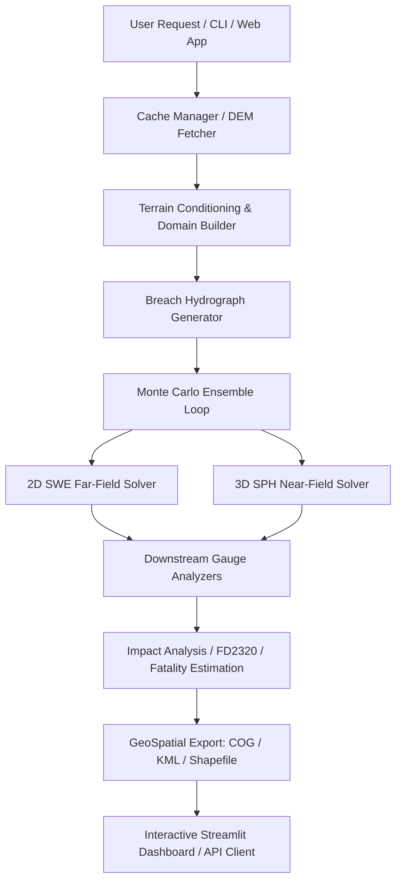

# 🌊 JalRaksha: Dam-Break Inundation Modelling System

JalRaksha is a high-performance Python package for dam-break inundation modelling, simulation, hazard mapping, and impact assessment. Developed specifically for the **Smart India Hackathon 2026 (Problem Statement 26161, sponsored by NTRO)**, JalRaksha utilizes a unique dual-engine numerical scheme (2D Shallow Water Equations for far-field propagation coupled with 3D Smoothed Particle Hydrodynamics for violent near-field breach dynamics) to deliver rapid Tier-1 screening forecasts.

---

## 🚀 Key Features

*   **Dual-Engine Solver**:
    *   *Far-Field*: Well-balanced 2D Shallow Water Equation (SWE) solver utilizing HLLC flux schemes, Audusse hydrostatic reconstruction, and MUSCL reconstruction with Manning's friction.
    *   *Near-Field*: Weakly Compressible Smoothed Particle Hydrodynamics (WCSPH) solver utilizing a Tait equation of state, hand-off boundary coupling, and PySPH integration.
*   **Offline-First & Local Caching**: Automated DEM tile cache retrieval (Copernicus GLO-30 DEM from public AWS COG servers) with local fallbacks, assuming zero network reliability on site.
*   **Probabilistic Monte Carlo Breach Ensemble**: Generates 100-member breach hydrograph ensembles using Froehlich, MacDonald, and Xu-Zhang regressions with Wahl uncertainty bands.
*   **Automated Impact & Fatality Assessment**:
    *   FD2320 Flood Hazard Classification (Low, Moderate, High, Extreme).
    *   Jonkman (2008), Graham (1999), and DeKay-McClelland (1993) fatality models.
    *   India-specific JRC depth-damage economic loss curves.
*   **Premium Interactive Dashboard**: Streamlit-based web interface featuring Folium interactive maps, peak discharge histograms, gauge arrival time envelopes, and automated export tools.
*   **REST API Layer**: Standard-library HTTP server with endpoints (`/health`, `/api/v1/dams`, `/api/v1/gauges`, `/api/v1/simulate`) to integrate with external systems.

---

## 🗺 System Architecture



---

## 📦 Installation & Setup

### Prerequisites
*   Python 3.11+
*   GDAL/GEOS system libraries (required for rasterio, geopandas, and shapely)

### Linux (Ubuntu/Debian) Installation
```bash
sudo apt-get update
sudo apt-get install -y gdal-bin libgdal-dev
git clone https://github.com/sih2026/jalraksha.git
cd jalraksha
pip install -e .[dev,viz,dashboard]
```

### Windows Installation
1.  Download and install OSGeo4W or run Python within a Conda/mamba environment to resolve GDAL dependencies:
    ```bash
    conda create -n jalraksha python=3.11 conda-forge::gdal conda-forge::libgdal -y
    conda activate jalraksha
    pip install -e .[dev,viz,dashboard]
    ```

---

## ⚙️ How to Run

### 1. Launch the Interactive Dashboard
Launch the premium web dashboard on port `8501`:
```bash
python -m streamlit run jalraksha/dashboard/app.py
```

### 2. Run the CLI Simulation (Tehri Dam Demo)
Execute a 3-member ensemble run for Tehri Dam:
```bash
python -m jalraksha.cli run --dam tehri --lat 30.3789 --lon 78.4789 --height 260 --storage 3540 --ensemble-size 3
```

### 3. Start the REST API Service
Launch the background HTTP API service on port `8502`:
```bash
python -m jalraksha.api
```
Example simulation query using `curl`:
```bash
curl -X POST http://127.0.0.1:8502/api/v1/simulate \
  -H "Content-Type: application/json" \
  -d '{"name": "Tehri", "lat": 30.3789, "lon": 78.4789, "height_m": 260.0, "storage_mm3": 3540.0, "ensemble_size": 3}'
```

---

## 🔬 Testing & Verification

JalRaksha features a multi-tier testing framework. Execute the test suite using `pytest`:

```bash
# Run the entire test suite
python -m pytest

# Run only the integration tests
python -m pytest tests/test_integration.py -v --tb=short

# Run validation metrics tests
python -m pytest tests/test_validation.py -v --tb=short
```

---

## ⚠️ Important Guidelines & Constraints

1.  **Approved Open Data Sources Only**: Under NTRO directives, geofenced, broken, or login-gated services (such as India-WRIS, ffs.india-water.gov.in, Bhuvan, or CartoDEM) are **strictly forbidden**. JalRaksha uses Copernicus GLO-30 DEM and GHSL Global Human Settlement layers via public AWS storage.
2.  **Mullaperiyar Dam**: Explicitly forbidden from simulation due to active litigation. All demonstrations must utilize **Tehri Dam** as the reference benchmark case.
3.  **Tier-1 Scope**: JalRaksha is built as a rapid screening instrument. Flood forecasts represent indicative envelopes and arrival times rather than absolute point depths. Always consult CWC Tier-2/3 detailed studies for emergency planning.

---

## 📄 License
JalRaksha is licensed under the MIT License.
