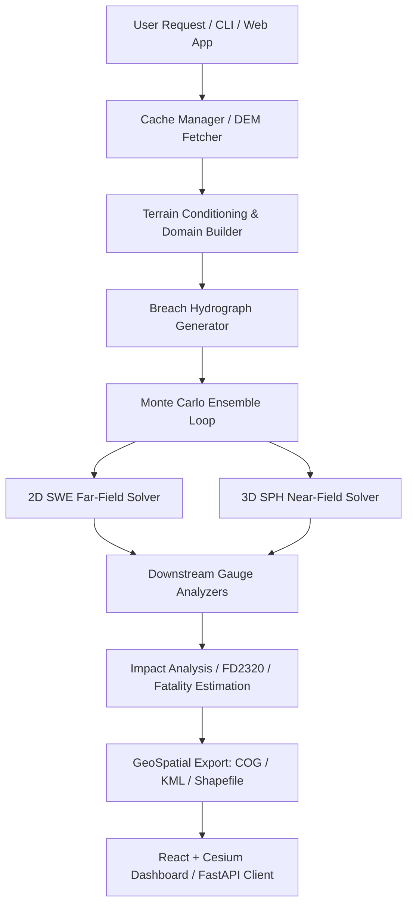

# 🌊 JalRaksha: Dam-Break Inundation Modelling System

JalRaksha is a high-performance Python package for dam-break inundation modelling, simulation, hazard mapping, and impact assessment. Developed specifically for the **Smart India Hackathon 2026 (Problem Statement 26161, sponsored by NTRO)**, JalRaksha utilizes a unique dual-engine numerical scheme (2D Shallow Water Equations for far-field propagation coupled with 3D Smoothed Particle Hydrodynamics for violent near-field breach dynamics) to deliver rapid Tier-1 screening forecasts.

---

## 🚀 Key Features

*   **Dual-Engine Solver**:
    *   *Far-Field*: Well-balanced 2D Shallow Water Equation (SWE) solver utilizing HLLC flux schemes, Audusse hydrostatic reconstruction, and MUSCL reconstruction with Manning's friction.
    *   *Near-Field*: Weakly Compressible Smoothed Particle Hydrodynamics (WCSPH) solver utilizing a Tait equation of state, hand-off boundary coupling, and PySPH integration.
*   **Offline-First & Local Caching**: Automated DEM tile cache retrieval (Copernicus GLO-30 DEM from public AWS COG servers) with local fallbacks, assuming zero network reliability on site.
*   **Probabilistic Monte Carlo Breach Ensemble**: Generates 100-member breach hydrograph ensembles using Froehlich, MacDonald, and Xu-Zhang regressions with Wahl uncertainty bands.
*   **Automated Impact & Fatality Assessment**:
    *   FD2320 Flood Hazard Classification (Low, Moderate, High, Extreme).
    *   Jonkman (2008), Graham (1999), and DeKay-McClelland (1993) fatality models.
    *   India-specific JRC depth-damage economic loss curves.
*   **Interactive Web Dashboard**: React + Vite frontend (Leaflet 2D map, Cesium 3D globe, playback timeline) served by a FastAPI backend, with peak discharge histograms, gauge arrival time envelopes, and export tools.
*   **REST API Layer**: Standard-library HTTP server with endpoints (`/health`, `/api/v1/dams`, `/api/v1/gauges`, `/api/v1/simulate`) to integrate with external systems.

---

## 🗺 System Architecture



---

## 📦 Installation & Setup

### Prerequisites
*   Python 3.11+
*   GDAL/GEOS system libraries (required for rasterio, geopandas, and shapely)

### Linux (Ubuntu/Debian) Installation
```bash
sudo apt-get update
sudo apt-get install -y gdal-bin libgdal-dev
git clone https://github.com/sih2026/jalraksha.git
cd jalraksha
pip install -e .[dev,viz]
```

### Windows Installation
1.  Download and install OSGeo4W or run Python within a Conda/mamba environment to resolve GDAL dependencies:
    ```bash
    conda create -n jalraksha python=3.11 conda-forge::gdal conda-forge::libgdal -y
    conda activate jalraksha
    pip install -e .[dev,viz]
    ```

---

## ⚙️ How to Run

### 1. Launch the Interactive Dashboard
Two processes — the FastAPI backend on `8000` and the React frontend on `3000`:
```bash
python scripts/run_api.py
```
```bash
npm run dev --prefix frontend
```
Then open http://localhost:3000. `scripts/run_api.py` sets the eager-task and
data-dir environment and pins the working directory to the repo root; see
`paraview/README.md` for why that matters.

### 2. Run the CLI Simulation (Tehri Dam Demo)
Execute a 3-member ensemble run for Tehri Dam:
```bash
python -m jalraksha.cli run --dam tehri --lat 30.3789 --lon 78.4789 --height 260 --storage 3540 --ensemble-size 3
```

### 3. Start the REST API Service
Launch the background HTTP API service on port `8502`:
```bash
python -m jalraksha.api
```
Example simulation query using `curl`:
```bash
curl -X POST http://127.0.0.1:8502/api/v1/simulate \
  -H "Content-Type: application/json" \
  -d '{"name": "Tehri", "lat": 30.3789, "lon": 78.4789, "height_m": 260.0, "storage_mm3": 3540.0, "ensemble_size": 3}'
```

### 4. Optional external engines (environment variables)

JalRaksha runs fully without any of these. Each one is *attempted* when
configured and *reported as absent* when not — nothing is silently substituted.

| Variable | Purpose | When unset |
| :--- | :--- | :--- |
| `JALRAKSHA_DFLOWFM_EXE` | Full path to the Deltares **D-Flow FM** `dflowfm` executable, for `solver="both"` runs. | `dflowfm` is looked up on `PATH`. If it is not there either, the comparison runs JalRaksha's own 2D SWE solver and the Comparison tab shows an orange banner saying Delft3D FM was not used. |
| `JALRAKSHA_PARAVIEW_EXE` | Full path to `paraview.exe` (the GUI) for the "View in ParaView (3D)" button. | Defaults to `C:/Program Files/ParaView 6.2.0/bin/paraview.exe`; the endpoint answers `paraview_not_found` if it is not there. |
| `JALRAKSHA_PVPYTHON_EXE` | Full path to `pvpython.exe`, used to build the per-run `.pvsm` state. | As above. |
| `JALRAKSHA_GEE_PROJECT` | Google Cloud project ID for **Google Earth Engine** — powers the observed Sentinel-1 water extent and the GHSL population-at-risk figure. | `GET /gee/latest` answers `source: "unavailable"` with the reason, and runs publish no population-at-risk figure. Nothing is estimated in their place. |
| `JALRAKSHA_DATA_DIR` | Where DEMs, exports, keyframes and the SQLite DB live. | `./data` |

```bash
export JALRAKSHA_DFLOWFM_EXE="C:/Program Files/Deltares/D-Flow FM/bin/dflowfm.exe"
```

#### Enabling Earth Engine

Three steps, all required:

```bash
pip install earthengine-api
```

```bash
earthengine authenticate
```

Then create or pick a Google Cloud project, **enable the Earth Engine API on
it** (`console.cloud.google.com` → APIs & Services → enable "Google Earth
Engine API"; free for non-commercial use via
<https://code.earthengine.google.com/register>), and point JalRaksha at it:

```bash
export JALRAKSHA_GEE_PROJECT=your-project-id
```

Every fetched scene is cached under `data/gee/`, so once a reach has been
fetched the dashboard keeps working offline and labels the layer as a cached
scene, with its real acquisition date.

**On naming.** When `dflowfm` is unavailable, the built-in solver takes over. It
integrates the same depth-averaged 2D Saint-Venant equations that D-Flow FM
solves, so it is described throughout as **Delft3D-class**. It is *not* Delft3D
and is never labelled as such — the Comparison tab states which engine produced
the numbers, in a banner, before showing any of them.

---

## 🔬 Testing & Verification

JalRaksha features a multi-tier testing framework. Execute the test suite using `pytest`:

```bash
# Run the entire test suite
python -m pytest

# Run only the integration tests
python -m pytest tests/test_integration.py -v --tb=short

# Run validation metrics tests
python -m pytest tests/test_validation.py -v --tb=short
```

---

## ⚠️ Important Guidelines & Constraints

1.  **Approved Open Data Sources Only**: Under NTRO directives, geofenced, broken, or login-gated services (such as India-WRIS, ffs.india-water.gov.in, Bhuvan, or CartoDEM) are **strictly forbidden**. JalRaksha uses Copernicus GLO-30 DEM and GHSL Global Human Settlement layers via public AWS storage.
2.  **Mullaperiyar Dam**: Explicitly forbidden from simulation due to active litigation. All demonstrations must utilize **Tehri Dam** as the reference benchmark case.
3.  **Tier-1 Scope**: JalRaksha is built as a rapid screening instrument. Flood forecasts represent indicative envelopes and arrival times rather than absolute point depths. Always consult CWC Tier-2/3 detailed studies for emergency planning.

---

## 📄 License
JalRaksha is licensed under the MIT License.
