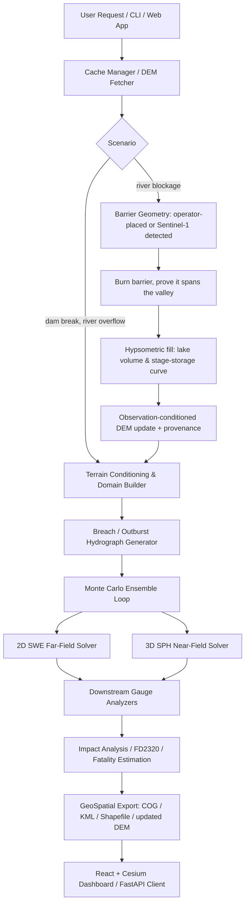

# 🌊 JalRaksha: Dam-Break Inundation Modelling System

JalRaksha is a high-performance Python package for dam-break inundation modelling, simulation, hazard mapping, and impact assessment. Developed specifically for the **Smart India Hackathon 2026 (Problem Statement 26161, sponsored by NTRO)**, JalRaksha utilizes a unique dual-engine numerical scheme (2D Shallow Water Equations for far-field propagation coupled with 3D Smoothed Particle Hydrodynamics for violent near-field breach dynamics) to deliver rapid Tier-1 screening forecasts.

---

## 🚀 Key Features

*   **Dual-Engine Solver**:
    *   *Far-Field*: Well-balanced 2D Shallow Water Equation (SWE) solver utilizing HLLC flux schemes, Audusse hydrostatic reconstruction, and MUSCL reconstruction with Manning's friction.
    *   *Near-Field*: Weakly Compressible Smoothed Particle Hydrodynamics (WCSPH) solver utilizing a Tait equation of state, hand-off boundary coupling, and PySPH integration.
*   **Offline-First & Local Caching**: Automated DEM tile cache retrieval (Copernicus GLO-30 DEM from public AWS COG servers) with local fallbacks, assuming zero network reliability on site.
*   **Probabilistic Monte Carlo Breach Ensemble**: Generates 100-member breach hydrograph ensembles using Froehlich, MacDonald, and Xu-Zhang regressions with Wahl uncertainty bands.
*   **River Blockage (Landslide Dam) Scenario**: Half the events PS-26161 names are natural blockages rather than dam failures. A landslide barrier is burned into the terrain, *proven* to span the valley, and its impounded volume **measured** by hypsometric fill of the modified DEM — a natural dam has no published gross storage, so the pipeline refuses to run one whose storage came from a slider. Released through Costa (1985), the one transcribed regression whose fitting population included natural dams.
*   **Observation-Conditioned DEM Update**: A landslide changes the terrain, and the cached DEM predates it. Copernicus GLO-30 is rewritten with the barrier burned in and written as a new GeoTIFF carrying full provenance. Every pixel outside the modified footprint stays bit-identical to the Copernicus source. It is **not** photogrammetry and every product says so — see the note below.
*   **Automated Impact & Fatality Assessment**:
    *   FD2320 Flood Hazard Classification (Low, Moderate, High, Extreme).
    *   Jonkman (2008), Graham (1999), and DeKay-McClelland (1993) fatality models.
    *   India-specific JRC depth-damage economic loss curves.
*   **Interactive Web Dashboard**: React + Vite frontend (Leaflet 2D map, Cesium 3D globe, playback timeline) served by a FastAPI backend, with peak discharge histograms, gauge arrival time envelopes, and export tools.
*   **REST API Layer**: Standard-library HTTP server with endpoints (`/health`, `/api/v1/dams`, `/api/v1/gauges`, `/api/v1/simulate`) to integrate with external systems.

---

## 🗺 System Architecture



---

## 🏔 River blockage, and what "rebuild the DEM" actually means

PS-26161 asks for flash-flood modelling from **natural dam / lake formations**
— Rishi Ganga (Feb 2021), Wapriyang, Phuktal, Kosi — as well as from dam
failures. `scenario_type: "river_blockage"` models one properly.

A landslide dam differs from an engineered dam in the one way that matters
most: **nobody surveyed it.** There is no published height and no published
gross storage. So the storage is *measured*:

1. The barrier is burned into the bed at an operator-supplied (or SAR-detected)
   position, and **proven to span the valley** — the fill is run, cells that got
   downstream are counted, and the deposit is widened and retried until none do.
   A barrier that cannot be made to span raises rather than reporting a small,
   plausible-looking lake that was quietly leaking around its ends.
2. The impounded volume comes from a **hypsometric fill** of the modified
   terrain, which also yields a real elevation–area–capacity curve. Scored
   against the closed-form capacity of a sloping V-valley, this is accurate to
   **0.127% at 30 m cells** and converges at second order.
3. `jalraksha.terrain.breach` **refuses** a blockage run whose `storage_source`
   is anything but that fill. Without the refusal a dashboard slider silently
   drives the outburst volume the first time somebody refactors, and the output
   still reads as a modelled result.

### The DEM is *updated*, not regenerated — and the code says so

"Rebuild the DEM from live satellite imagery" is not achievable on this
project's data policy, and pretending otherwise would be the overclaim
CLAUDE.md exists to prevent:

*   **Stereo optical pairs** (Cartosat, Pleiades, WorldView) are the only
    practical route to a post-event DSM at this scale. They are geo-fenced or
    commercial; CartoDEM and Bhuvan are forbidden outright.
*   **Sentinel-1 interferometry** would work in principle, but Earth Engine
    carries GRD, not SLC. An SLC interferogram means SNAP or ISCE, offline, at
    hours per pair — against a demo-day assumption of no network.
*   **Sentinel-2 has no stereo.** It is a single-look sensor.

What ships instead is an **observation-conditioned DEM update**: Copernicus
GLO-30 with the landslide barrier burned in, written as a new GeoTIFF whose own
metadata carries

```
JALRAKSHA_NOT_A_SURVEY = "NOT photogrammetry, NOT InSAR, NOT an elevation
surface derived from imagery. This is Copernicus GLO-30 with a landslide
barrier and, where an observation was available, an observed lake extent
burned into it."
```

Only the **change** is reprojected back onto the source raster, so every pixel
outside the barrier footprint is bit-identical to Copernicus — asserted by a
test. The dashboard shows a matching banner above the map whenever a run's
terrain was modified, because the 3D globe renders the modified surface whether
or not anything says so.

### Auto-detection, and a refusal that is itself a result

`GET /gee/blockage` differences a Sentinel-1 pre-event median against a
**single** post-event scene (a composite would make "rebuilt from the
2021-02-08 scene" untrue), subtracts JRC permanent water, and requires what
remains to sit on a watercourse.

Run live over the Rishi Ganga, it **refuses** — and the refusal is worth more
than a mask nobody checked. JRC's permanent-water band covers **0.001%** of that
window, against 0.57% at Tehri and 44.5% at Hirakud: a 30 m Landsat-derived
product does not resolve a narrow braided Himalayan headwater, so there is
nothing to verify a same-day radar mask against. That is a documented limit of
open-data change detection over exactly the terrain the problem statement cares
about. **The manual barrier path needs no network and is the demo's guaranteed
floor.**

---

## 📦 Installation & Setup

### Prerequisites
*   Python 3.11+
*   GDAL/GEOS system libraries (required for rasterio, geopandas, and shapely)

### Linux (Ubuntu/Debian) Installation
```bash
sudo apt-get update
sudo apt-get install -y gdal-bin libgdal-dev
git clone https://github.com/sih2026/jalraksha.git
cd jalraksha
pip install -e .[dev,viz]
```

### Windows Installation
1.  Download and install OSGeo4W or run Python within a Conda/mamba environment to resolve GDAL dependencies:
    ```bash
    conda create -n jalraksha python=3.11 conda-forge::gdal conda-forge::libgdal -y
    conda activate jalraksha
    pip install -e .[dev,viz]
    ```

---

## ⚙️ How to Run

### 1. Launch the Interactive Dashboard
Two processes — the FastAPI backend on `8000` and the React frontend on `3000`:
```bash
python scripts/run_api.py
```
```bash
npm run dev --prefix frontend
```
Then open http://localhost:3000. `scripts/run_api.py` sets the eager-task and
data-dir environment and pins the working directory to the repo root; see
`paraview/README.md` for why that matters.

### 1b. Run a river-blockage scenario

In the dashboard: pick **Rishi Ganga / Dhauliganga, Chamoli (blockage site)**,
set scenario to **River blockage (landslide dam)**, leave the barrier source on
**Manual** (the offline path), and adjust crest height and width. There are no
height/storage sliders — a landslide dam has neither, and the impounded volume
is measured from the terrain.

Or over HTTP:

```bash
curl -X POST http://localhost:8000/runs -H "Content-Type: application/json" -d '{"dam_id":"rishi_ganga","scenario_type":"river_blockage","solver":"swe","blockage_source":"manual","blockage_lat":30.5207,"blockage_lon":79.6098,"blockage_crest_height_m":110,"blockage_width_m":1500,"ensemble_size":4,"solver_duration_s":7200,"target_resolution":100}'
```

Measured at the Dhauliganga gorge below Tapovan (1,704 m bed, 1,200 m of
relief), crest height sets the impounded volume steeply:

| crest | 55 m | 90 m | 120 m | 150 m |
| :--- | ---: | ---: | ---: | ---: |
| lake | 0.6 MCM | 6.3 MCM | 26.0 MCM | 60.8 MCM |

> **Demo-day cost.** Compute scales badly with barrier size on steep terrain —
> the CFL limit cuts the timestep as a deep release accelerates down a gorge.
> The 55 m case solved 4 members in about 15 minutes at 100 m; the 120 m case
> took roughly 40. Pick a modest barrier or a short `solver_duration_s` live,
> and pre-compute anything larger — the run picker loads a finished run
> instantly.

### 1c. Drainage controls — when a flood refuses to recede

Three request fields exist because a 24 h Khadakwasla run once peaked and then
held flat, with 46 cells stuck at SEVERE and ~42% of the released volume trapped.
All three default to the safe setting; they are documented here because turning
one off brings the plateau back, and because a wider domain is expensive.

| Field | Default | What it does |
| :--- | :--- | :--- |
| `notch_breach` | `true` | Cuts a real gap through the dam crest at the breach cell, down to the dam-height invert. Without it, the breach is only a source term on an intact wall, and water spreading upstream is sealed into the reservoir bowl |
| `fill_max_depth_m` | `3.0` | Fills depressions shallower than this — pits manufactured by bilinear downsampling of a narrow channel, which trap flood water permanently. Genuine basins deeper than the threshold are left standing. `0` disables it |
| `domain_margins_km` | unset | `{"west":..,"east":..,"south":..,"north":..}` in km from the dam, for a domain biased downstream instead of centred on it. Overrides the preset's `domain_radius_km` entirely |

```bash
curl -X POST http://localhost:8000/runs -H "Content-Type: application/json" -d '{"dam_id":"khadakwasla","solver":"swe","ensemble_size":4,"solver_duration_s":86400,"target_resolution":300,"domain_margins_km":{"west":40,"east":200,"south":94,"north":94},"fill_max_depth_m":3.0,"notch_breach":true}'
```

> **Long runs should not go through the API.** A run submitted to `POST /runs`
> executes in a subprocess spawned by the server and dies with it — three runs
> were lost that way in one session, each discarding hours of compute, because
> the ensemble returns every member at once and writes nothing per-member. For
> anything measured in hours use a standalone script, which survives the server
> restarting:
>
> ```bash
> python scripts/run_khadakwasla_drainage_check.py
> ```

### 2. Run the CLI Simulation (Tehri Dam Demo)
Execute a 3-member ensemble run for Tehri Dam:
```bash
python -m jalraksha.cli run --dam tehri --lat 30.3789 --lon 78.4789 --height 260 --storage 3540 --ensemble-size 3
```

### 3. Start the REST API Service
Launch the background HTTP API service on port `8502`:
```bash
python -m jalraksha.api
```
Example simulation query using `curl`:
```bash
curl -X POST http://127.0.0.1:8502/api/v1/simulate \
  -H "Content-Type: application/json" \
  -d '{"name": "Tehri", "lat": 30.3789, "lon": 78.4789, "height_m": 260.0, "storage_mm3": 3540.0, "ensemble_size": 3}'
```

### 4. Optional external engines (environment variables)

JalRaksha runs fully without any of these. Each one is *attempted* when
configured and *reported as absent* when not — nothing is silently substituted.

| Variable | Purpose | When unset |
| :--- | :--- | :--- |
| `JALRAKSHA_DFLOWFM_EXE` | Full path to the Deltares **D-Flow FM** kernel (`dflowfm-cli.exe`), for `solver="both"` runs and for validation. | `dflowfm-cli` then `dflowfm` are looked up on `PATH`, then the usual Deltares install locations are searched automatically. If nothing is found, the comparison runs JalRaksha's own 2D SWE solver and the Comparison tab shows an orange banner saying Delft3D FM was not used. |
| `JALRAKSHA_PARAVIEW_EXE` | Full path to `paraview.exe` (the GUI) for the "View in ParaView (3D)" button. | Defaults to `C:/Program Files/ParaView 6.2.0/bin/paraview.exe`; the endpoint answers `paraview_not_found` if it is not there. |
| `JALRAKSHA_PVPYTHON_EXE` | Full path to `pvpython.exe`, used to build the per-run `.pvsm` state. | As above. |
| `JALRAKSHA_GEE_PROJECT` | Google Cloud project ID for **Google Earth Engine** — powers the observed Sentinel-1 water extent, the GHSL population-at-risk figure, and new-water detection for river blockages. | `GET /gee/latest` and `GET /gee/blockage` answer `source: "unavailable"` with the reason, and runs publish no population-at-risk figure. Nothing is estimated in their place. The **manual** blockage path is unaffected and needs no Earth Engine at all. |
| `JALRAKSHA_DATA_DIR` | Where DEMs, exports, keyframes and the SQLite DB live. | `./data` |

```bash
export JALRAKSHA_DFLOWFM_EXE="C:/Program Files/Deltares/Delft3D FM Suite 2026.01 HM/plugins/DeltaShell.Dimr/kernels/x64/bin/dflowfm-cli.exe"
```

#### Enabling Earth Engine

Three steps, all required:

```bash
pip install earthengine-api
```

```bash
earthengine authenticate
```

Then create or pick a Google Cloud project, **enable the Earth Engine API on
it** (`console.cloud.google.com` → APIs & Services → enable "Google Earth
Engine API"; free for non-commercial use via
<https://code.earthengine.google.com/register>), and point JalRaksha at it:

```bash
export JALRAKSHA_GEE_PROJECT=your-project-id
```

Every fetched scene is cached under `data/gee/`, so once a reach has been
fetched the dashboard keeps working offline and labels the layer as a cached
scene, with its real acquisition date.

#### Validating against Delft3D FM

With a Delft3D FM Suite installed, JalRaksha can be scored against the real
Deltares kernel and against analytical theory in one command:

```bash
python scripts/validate_against_delft3d.py --case ritter
```

This writes `data/validation/ritter_validation.png` and
`validation_metrics.json`. Measured on this machine (dimrset 2026.01,
`dflowfm-cli` 1.2.184), on a 10 m dam-break at t = 40 s, Δx = 10 m:

| | RMSE vs exact | depth at dam |
| :--- | ---: | ---: |
| JalRaksha 2D SWE | 0.0317 m | 4.532 m |
| Delft3D FM | 0.0349 m | 4.515 m |
| Ritter (1892) exact | — | 4.444 m |

Both engines land within ~0.3% of theory and within 3 cm of each other. Full
detail, including what did **not** work, is in
[`docs/validation_findings.md`](docs/validation_findings.md).

**Finding the kernel.** Not every Delft3D FM Suite edition ships one. The
"Open" editions (e.g. `2026.02 OpenHMWQ`) install the DeltaShell framework
*without* `plugins\DeltaShell.Dimr\kernels`, so the GUI launches and the licence
works but there is nothing to compute with — `DeltaShell.Console.exe` is a
scripting host, not a solver. Editions that do ship kernels put them at:

```
<install>\plugins\DeltaShell.Dimr\kernelsdin\dflowfm-cli.exe
```

That path is searched automatically, so `JALRAKSHA_DFLOWFM_EXE` is only needed
for installs in unusual locations.

**On naming.** When `dflowfm` is unavailable, the built-in solver takes over. It
integrates the same depth-averaged 2D Saint-Venant equations that D-Flow FM
solves, so it is described throughout as **Delft3D-class**. It is *not* Delft3D
and is never labelled as such — the Comparison tab states which engine produced
the numbers, in a banner, before showing any of them.

---

## 🔬 Testing & Verification

JalRaksha features a multi-tier testing framework. Execute the test suite using `pytest`:

```bash
# Run the entire test suite
python -m pytest

# Run only the integration tests
python -m pytest tests/test_integration.py -v --tb=short

# Run validation metrics tests
python -m pytest tests/test_validation.py -v --tb=short
```

---

## ⚠️ Important Guidelines & Constraints

1.  **Approved Open Data Sources Only**: Under NTRO directives, geofenced, broken, or login-gated services (such as India-WRIS, ffs.india-water.gov.in, Bhuvan, or CartoDEM) are **strictly forbidden**. JalRaksha uses Copernicus GLO-30 DEM and GHSL Global Human Settlement layers via public AWS storage.
2.  **Mullaperiyar Dam**: Explicitly forbidden from simulation due to active litigation. All demonstrations must utilize **Tehri Dam** as the reference benchmark case.
3.  **Tier-1 Scope**: JalRaksha is built as a rapid screening instrument. Flood forecasts represent indicative envelopes and arrival times rather than absolute point depths. Always consult CWC Tier-2/3 detailed studies for emergency planning.

---

## 📄 License
JalRaksha is licensed under the MIT License.
