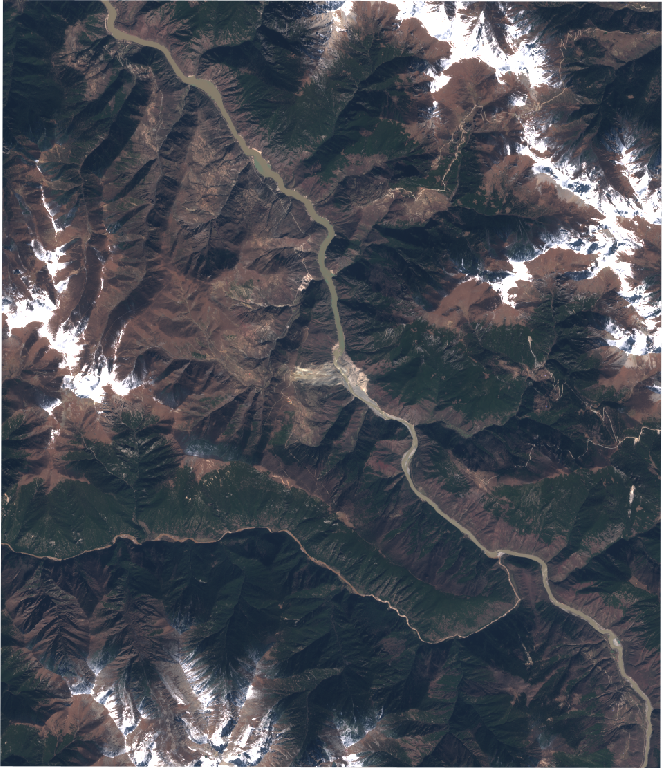
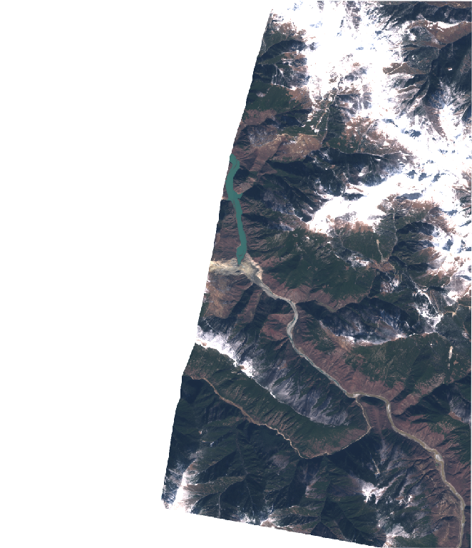

# Validation findings

Measured results, each reproducible by the command given. Anything that was
**not** verified says so. Numbers here are copied from actual command output,
not from expectations.

Machine: Windows 11, Python 3.14. Delft3D FM Suite 2026.01 HM,
dimrset build 2025-10-20, `dflowfm-cli.exe` 1.2.184.

---

## 1. JalRaksha vs Delft3D FM vs Ritter — the validation case

```bash
python scripts/validate_against_delft3d.py --case ritter
```

Ritter (1892) dry-bed dam-break: flat frictionless bed, instantaneous barrier
removal, h₀ = 10 m, t = 40 s, Δx = 10 m, 4 km channel. The exact solution is
known, so both engines are scored against **theory** rather than against each
other.

| | RMSE vs exact | max abs error | depth at dam |
| :--- | ---: | ---: | ---: |
| JalRaksha 2D SWE | **0.0317 m** | 0.2644 m | 4.532 m |
| Delft3D FM | **0.0349 m** | 0.2265 m | 4.515 m |
| exact (4h₀/9) | — | — | **4.444 m** |

Engine-vs-engine agreement: **0.0294 m RMSE**. Both land within ~0.3% of theory
on a 10 m dam-break, and within 3 cm of each other.

Figure: `data/validation/ritter_validation.png`.

### The boundary artifact, and why the first numbers were wrong

The first run scored JalRaksha at 0.0445 m and Delft3D at 0.0897 m — Delft3D
apparently twice as bad. It was an artifact. The **outermost cell** of the
closed D-Flow FM domain accumulates water: 1.06 m on a 2000 m domain, still
0.41 m at 4000 m, while its immediate neighbours sat at 0.001–0.03 m. A genuine
boundary reflection would grow as the domain shortens and spread over many
cells; this did neither.

Boundary cells are not part of the interior solution in any finite-volume
scheme, so three cells are now trimmed from each end before scoring
(`BOUNDARY_MARGIN_CELLS`). The excluded strips are **shaded on the figure** so
the reader can see what was and was not counted. With them included, the
comparison would have read "Delft3D is worse" when the real cause was the
domain edge.

---

## 2. Sentinel-1 SAR water extent — works on plains, not in gorges

```bash
python -m pytest tests/test_gee.py -q     # with JALRAKSHA_GEE_PROJECT set
```

Water mask from VV backscatter, thresholded per scene by a split-based Otsu
method, then **measured against JRC Global Surface Water** (Pekel et al. 2016)
before publication.

| Reach | Terrain | Recall | **Precision** | Outcome |
| :--- | :--- | ---: | ---: | :--- |
| Hirakud (Mahanadi) | flat plain | 0.557 | **0.768** | mask published |
| Tehri (Bhagirathi) | steep gorge | 0.945 | **0.010** | **refused** |

Over Tehri, 99% of what VV thresholding calls water is radar shadow on
hillsides. Whole-scene Otsu classified **45% of a mountain valley** as water and
produced a mask that looked entirely credible. The VV histogram there is
*unimodal* — one land mode near −10 dB with a shadow tail — so Otsu bisected the
land distribution rather than separating water.

JRC-known permanent water in that window is **0.57%** of the scene, and VV over
it has median −23.1 dB. No threshold reached precision above 0.08. Slope
masking (water is horizontal) lifted it only 0.076 → 0.099.

**This is a property of the physics, not a defect to tune away.** Terrain-
corrected local-incidence-angle masking (Small 2011) is the documented fix and
is *not implemented*. The module refuses below 0.5 precision and reports the
measured numbers.

---

## 3. Near-field SPH — hydrostatic convergence

PySPH 1.0b2 WCSPH, Wendland quintic kernel. Still water in a closed tank must
stay still, and pressure must follow ρg·h.

| | dp/d(depth) error vs ρg | max residual speed |
| :--- | ---: | ---: |
| uniform initial density | 28.9% | 0.236 m/s |
| + hydrostatic initial density | 8.8% | 0.236 m/s |
| + `n_damp=50`, t = 4 s | **3.2%** | **0.166 m/s** |

Initialising every particle at uniform ρ₀ starts the column at zero pressure, so
it must compress under its own weight before it can support itself. Inverting
the Tait equation for the hydrostatic pressure removes that transient.

At low resolution the pressure gradient is **not measurable** — the interior
band collapses to about one particle layer and the fit returned 27% and 123% for
the same physics at two run lengths. It now reports `None` with a reason rather
than a number.

Determinism, on real terrain:

| Change | Particle field |
| :--- | :--- |
| RNG seed 1 → 999, same dam and terrain | **identical** |
| Tehri 120 m → 200 m head | different (446 → 513 particles) |
| Tehri → Khadakwasla terrain | different (446 → 573 particles) |

---

## 4. Population at risk — real GHSL

GHSL P2023A epoch 2020, resampled onto the solver grid **by sum** (counts are
extensive; a mean would divide the population by the cell-count ratio — a
sixteen-fold undercount at 400 m over a 100 m source).

Tehri domain, 400 m resolution, 90 min simulated:

| Dam height | Domain population | Flooded cells | **Population at risk** |
| ---: | ---: | ---: | ---: |
| 260 m | 295,025 | 222 | **220** |
| 120 m | 295,025 | 256 | **322** |

The lower head drains the same storage more slowly and spreads further into
populated valley floor — hence more wetted cells and a higher figure.

Per-gauge PAR is deliberately **null**: splitting a domain figure across gauges
needs a catchment radius per gauge that no source defines.

---

## 5. Hypsometric lake volume — scored against a closed form

```bash
python -m pytest tests/test_blockage.py -q
```

A landslide dam's impounded volume is measured, not published, so the measuring
code needs a known answer to be scored against. A V-valley with a constant
longitudinal slope has one: filled to depth `H`, its capacity is

```
V = H³ / (3 · m · S)          m = cross slope, S = channel gradient
```

Cell-centred fill against that exact capacity, integrated over the same reach
(the deposit occupies channel volume, so the analytic integral starts at the
same place rather than building a tolerance around a known offset):

| cell size | modelled | exact | error |
| ---: | ---: | ---: | ---: |
| 60 m | 6.7083e+07 m³ | 6.6734e+07 m³ | **0.523%** |
| 30 m | 6.9422e+07 m³ | 6.9334e+07 m³ | **0.127%** |
| 15 m | 7.0680e+07 m³ | 7.0658e+07 m³ | **0.031%** |

Roughly a factor of four per halving — second order, which is what a
cell-centred sum over a smooth cross-section should give. A first-order trend
would mean the fill is losing a boundary row. The fitted storage exponent
recovers the prism's cubic capacity at **b = 3.07** (exact 3) with a log10 RMS
residual of 0.011.

At the 100–200 m the dashboard runs, this discretisation is far smaller than
GLO-30's own vertical error over Himalayan terrain.

### Scale sanity on real terrain

Dhauliganga gorge below Tapovan, 1,704 m bed, 1,200 m of cross-valley relief:

| crest | 55 m | 90 m | 120 m | 150 m |
| :--- | ---: | ---: | ---: | ---: |
| lake volume | 0.6 MCM | 6.3 MCM | 26.0 MCM | 60.8 MCM |
| deposit volume | 3.4e6 m³ | 7.9e6 m³ | 1.3e7 m³ | 1.9e7 m³ |

Every deposit volume falls inside the 10⁶–10⁸ m³ range Costa & Schuster (1988)
report for surveyed natural dams, and none of the four leaked or spilled. The
storage exponent on this reach fits **b ≈ 6.3** with a log10 residual of 0.19 —
a steep narrow gorge is emphatically not the cubic prism above, and that
residual is why the curve is reported alongside the fit rather than instead of it.

A 55 m barrier here produces a local surge reaching no gauge within an hour.
That is the honest answer for a deposit that size on a reach that steep, not a
broken run.

---

## 6. New-water detection over the Rishi Ganga — a measured refusal

```bash
curl "http://localhost:8000/gee/blockage?reach=rishi_ganga"
```

The detector differences a Sentinel-1 pre-event median against a single
post-event scene and checks the **pre-event** mask against JRC Global Surface
Water. (Checking the *difference* against permanent water would reject every
true positive: a lake that formed last week is definitionally absent from a
32-year product.)

Over the Raini window it refuses, and the reason is a measurement. JRC
permanent water, occurrence > 80%, as a fraction of a 0.2° window:

| reach | JRC permanent water | verdict |
| :--- | ---: | :--- |
| Rishi Ganga (Raini) | **0.001%** | no usable reference — refuse |
| Tehri (Bhagirathi) | 0.572% | reference exists; fails on precision (0.010) |
| Hirakud (Mahanadi) | 44.520% | passes (precision 0.77) |

0.001% of that window is about **one cell at 60 m**. JRC comes from 30 m
Landsat and its permanent-water band does not resolve a narrow braided
Himalayan headwater, so there is nothing to verify a same-day radar mask
against. An unverifiable mask is not a verified mask.

This is a documented limit of open-data change detection over exactly the
terrain PS-26161 names first. `MIN_JRC_PRECISION` was **not** widened to make it
pass. The manual barrier path runs fully offline and carries the demo.

> **Superseded in part by section 9.** The refusal is real, but "no usable
> reference" is not the whole reason. Section 9 runs the same detector against
> the Baige barrier lakes on the Jinsha River — a wide channel where JRC *does*
> map the river, with the lake optically confirmed — and it refuses there too,
> because the pre-event mask classifies **63% of the gorge as water**. The
> limiting defect is VV thresholding against radar shadow, not the reference.

---

## 7. Delta-add DEM write — bit-identical outside the footprint

```bash
python -m pytest tests/test_dem_update.py -q
```

Only the elevation **change** is reprojected back onto the source raster, with
nearest-neighbour resampling. Every pixel outside the barrier footprint compares
bit-identical to the Copernicus source, asserted directly rather than to a
tolerance.

A bilinear round trip through UTM would fail this on every pixel in the raster
while looking entirely correct in a viewer — the same effect
`load_dem_as_grid`'s own smoothing table measures at tens of metres of
valley-floor error.

Also asserted at the **file** level, because a correct dict inside a process
nobody is running is not a label: every written GeoTIFF carries
`JALRAKSHA_NOT_A_SURVEY`, and an operator-placed barrier never carries a
satellite scene id.

---

## 8. The Khadakwasla drainage plateau — a measured failure, fixed in mechanism

```bash
python -m pytest tests/test_terrain.py -q -k "fill_depressions or notch_breach"
```

A 24 h Khadakwasla run on the 27 km dam-centred domain **never receded**. The
hazard classification rose to a peak at t ~ 17,876 s and then held flat: **46
cells stayed SEVERE for the last 7.5 simulated hours**, with roughly **42% of the
released volume permanently trapped**. Both a 10-member and a 100-member baseline
peaked at the same time, which ruled out the ensemble as the cause.

The diagnosis is that none of it was hydraulics. Three modelling artefacts each
created water with nowhere to go:

1. **The dam ridge was never breached in the terrain.** `inject_breach_hydrograph`
   adds depth at a single cell each timestep — a source term carrying no momentum
   direction — on a bed where the intact crest is still standing. Water spilling
   downstream left easily; water spreading back toward the reservoir landed in a
   genuine closed basin, bounded by valley walls on three sides and the unbreached
   crest on the fourth, and stayed there because the domain starts dry and nothing
   removes it.
2. **Bilinear downsampling manufactures pits.** Averaging a narrow channel onto a
   coarse grid blends the bed with its banks, producing local minima that exist
   only in the resampled raster. The solver's own flood water pools in them
   permanently — the artifact class CLAUDE.md warns about, observed doing exactly
   what it warns of.
3. **The domain was too small to drain into.** A 54 x 54 km box centred on the dam
   spends half its cells on the Western Ghats and the Arabian Sea while the flood
   runs east down the Mutha to the Mula-Mutha and the Bhima.

The fixes are `run.py::_notch_breach_into_bed` (`notch_breach`, default `True`),
`terrain/conditioning.py::fill_depressions` (`fill_max_depth_m`, default `3.0`),
and `load_dem_as_grid(margins_km=...)` exposed as `RunRequest.domain_margins_km`.

Two properties are asserted rather than assumed, because both fixes could
otherwise hide the defect instead of removing it:

- **The notch cannot invent terrain.** The invert is clamped never to fall below
  the lowest bed already present just outside the notch footprint, so it can only
  open a path to terrain that exists — never dig a new pit deeper than the
  surrounding channel.
- **The fill preserves real basins.** It computes the full hydrological fill, then
  caps the raise applied per cell. Shallow resampling noise fills completely; a
  reservoir bowl or lake keeps standing at very nearly its original depth. The
  unrestricted variant, which does remove every local minimum, is tested
  separately so the difference between the two is explicit.

### The confirmation run — measured 2026-09-04, and the plateau SURVIVES

```bash
python scripts/run_khadakwasla_drainage_check.py --resolution 500 --duration-h 24 --members 4 --snapshots 60
```

240 x 188 km east-biased domain, **500 m**, 24 h, 4 members, all three fixes on.
64 min wall clock on 16 cores. Series:
`data/keyframes/khadakwasla_drainage_check/hazard_series.json`.

| t (h) | wet cells | low | mod | sig | severe | extreme | wet severity |
| ---: | ---: | ---: | ---: | ---: | ---: | ---: | ---: |
| 1.6 | 29 | 1 | 6 | 5 | 7 | 10 | 0.690 |
| 3.3 | 66 | 6 | 9 | 19 | 20 | 12 | 0.618 |
| 4.9 | 89 | 5 | 28 | 27 | 29 | 0 | 0.512 |
| 8.1 | 99 | 12 | 21 | 42 | 24 | 0 | 0.482 |
| 13.0 | 101 | 15 | 20 | 39 | 27 | 0 | 0.481 |
| 17.9 | 96 | 9 | 21 | 39 | 27 | 0 | 0.503 |
| 24.0 | 93 | 6 | 21 | 39 | 26 | 1 | 0.518 |

**It does not recede.** Wet extent peaks at 104 cells at t = 8.5 h; SEVERE holds
between 23 and 27 from t = 4.9 h to the 24 h cutoff — flat for **19 simulated
hours** — and wet-cell severity flattens at ~0.48-0.52. Neither threshold is
ever crossed: `safe_at_s` (SEVERE and EXTREME both zero) and `fully_green_at_s`
(nothing above LOW) are both **null**. The fixes did not close the plateau.

Cell counts are **not** comparable to the pre-fix baseline quoted above: that
run used a different resolution, so a cell is a different area. Do not read
46 → 26 SEVERE as an improvement.

**The volume balance is new, and it says the water never got the chance to
leave.** Median across 4 members: **85.276 MCM released, 0.000 MCM exited,
85.276 MCM retained**, closing to 0.000%. That is *not* the 42%-trapped failure
repeating. The nearest domain edge is 40 km west and the outlet edge 200 km
east, while the flood reached only **25 km** downstream — so no water could have
exited, and 100% retained is arithmetic, not pathology. The east-biased domain
did its job of removing the boundary as a confound; it also means boundary
outflow tells us nothing on this run.

**Where the water actually went.** From the exported `h_max_median_cog.tif`:
138 wet cells spanning **24.5 km E-W by 15.0 km N-S**, mean distance from the
dam 13.3 km, only 28 cells within 5 km of it. So the flood *did* route east down
the Mutha as intended — it is not ponded at the breach — and then stalled as a
~25 km standing pool, mean h_max 4.51 m, peak 11.87 m.

### Resolution was suspected and is RULED OUT — the 300 m run, 2026-09-04

```bash
python scripts/run_khadakwasla_drainage_check.py --resolution 300 --duration-h 24 --members 4 --snapshots 60 --tag khadakwasla_drainage_300m
```

The obvious objection to the 500 m run was the grid. That resolution was chosen
to buy a faster first look, and the Mutha is 50–100 m wide, so a cell averages
the channel with its banks and leaves no thalweg to convey water — defect (2)
above, *made worse* rather than tested. The objection was itself testable, so it
was tested: the identical run at **300 m** (180,480 → 501,600 cells, 5 h 1 min
wall clock on 16 cores). Series:
`data/keyframes/khadakwasla_drainage_300m/hazard_series.json`.

**It plateaus the same way.** Wet extent peaks at 238 cells at t = 8.54 h — the
500 m run peaked at **the same 8.54 h** — and severe+extreme settles at 73–77
cells from t = 12 h to the cutoff, with wet-cell severity flat at 0.535–0.553
across the final 16 hours. `safe_at_s` and `fully_green_at_s` are both null
again.

Compared on AREA rather than cell counts, which is the only valid comparison
across resolutions:

| | wet area | severe+extreme | wet severity | max reach | E–W span |
| :--- | ---: | ---: | ---: | ---: | ---: |
| 500 m | 23.25 km² | 6.75 km² | 0.518 | 25.2 km | 24.5 km |
| 300 m | 20.43 km² | 6.57 km² | 0.551 | 25.6 km | 24.6 km |

Within ~12% on wet area, ~3% on severe area, and the flood halts at the **same
place** with the same timing. Refining the grid by 1.7× in each direction
changes nothing that matters. **The plateau is not a discretisation artefact**,
and the confound raised against the 500 m run does not survive the measurement.
The volume balance is unchanged in character: 85.309 MCM released, 0.000 exited,
100% retained, closing to 0.000%, for the same reason as before — the flood
never approaches a boundary.

### What is now excluded, and what is not

Excluded by measurement:

- **The domain boundary.** The flood reaches 25 km; the nearest edge is 40 km.
- **Ponding at the breach.** Only 28 of 138 wet cells (500 m) lie within 5 km of
  the dam; the flood routes east down the Mutha as intended.
- **Grid resolution.** 500 m and 300 m agree on extent, timing and severity.
- **The ensemble.** Four members here; the pre-fix baseline plateaued
  identically at 10 and 100 members.

**Not resolved:** whether the residual standing water is genuine slow drainage of
a flat floodplain — 85 MCM over ~20 km² of the Mutha corridor is ~4 m mean
depth, and after the reservoir empties at 2.88 h no further inflow drives it out,
so a multi-day recession would be physically unremarkable — or whether
depressions survive `fill_max_depth_m = 3.0` and still trap it. Separating the
two needs either a much longer run or an audit of what the fill actually raised
and what it left.

**The honest statement:** the three fixes are implemented and unit-tested; the
hazard does not recede to green within 24 h at either resolution; and the cause
is no longer attributable to any of the four mechanisms listed above.

---

## 9. Does auto-detection work anywhere? — Baige 2018, and the answer is no

```bash
python scripts/detect_blockage_experiment.py --stage preflight   # imagery + scene table
python scripts/detect_blockage_experiment.py --stage detect      # the real detector
python scripts/detect_blockage_experiment.py --stage diagnostic  # GATE 1 BYPASSED, not a detection
```

Section 6 measured a refusal over the Rishi Ganga and attributed it to an absent
reference: JRC permanent water covers 0.001% of that window, so the pre-event
mask cannot be verified against anything. That reading was incomplete, because
the refusal happens at Gate 1 before any new-water logic runs — it could not
tell us whether the rest of the detector works.

So the detector was run against a landslide dam on a **major channel**: the
**Baige (白格) barrier lakes on the Jinsha River**, Tibet, 10 October and 3
November 2018. Rishi Ganga was kept as the control.

### The lake is real, and it is in the window

The second Baige lake is unambiguous in cloud-free Sentinel-2, one week apart:

| 2018-11-02, before | 2018-11-09, lake standing |
| :--- | :--- |
|  |  |

A thin river becomes a wide impoundment terminating exactly at the landslide
scar. Three Sentinel-1 IW/VV acquisitions fall inside that lake's ten-day life
(3 Nov descending, 8 Nov ascending and descending). Nothing about the input is
marginal — this is as favourable a case as open data offers.

### Every case refuses, including that one

| case | window | JRC reference | pre-mask **water fraction** | precision | recall | verdict |
| :--- | ---: | ---: | ---: | ---: | ---: | :--- |
| Baige, Oct 2018 | ±0.10° | 0.5181% | **63.4%** | 0.0075 | 0.922 | refused |
| Baige, Oct 2018 | ±0.20° | 0.2603% | **68.1%** | 0.0033 | 0.872 | refused |
| Baige, Nov 2018 | ±0.10° | 0.5181% | **63.4%** | 0.0075 | 0.922 | refused |
| Baige, Nov 2018 | ±0.20° | 0.2603% | **68.1%** | 0.0033 | 0.872 | refused |
| Rishi Ganga (control) | ±0.10° | 0.0008% | 57.9% | 0.0000 | 0.000 | refused |
| Rishi Ganga (control) | ±0.20° | 0.0134% | 45.8% | 0.0002 | 0.592 | refused |

`MIN_JRC_PRECISION` is 0.5. Nothing came within two orders of magnitude of it.

**The two Baige rows per window are identical by construction** — both events
share one pre-window ending 2018-10-09, before the first barrier formed, so the
November case is not differenced against a pre-state already containing the
October lake. Identical numbers are the harness confirming itself, not a copy.

### The real defect is the threshold, not the reference

Section 6 named the Rishi Ganga's problem as a missing reference. Baige has a
reference — 0.52% of the window, comparable to Tehri's 0.572% — and still fails,
by a **different** branch of the same gate (`gate1_mask_missed_real_reference`
against the control's `gate1_no_usable_reference`).

Read the water fraction column. The split-based Otsu threshold, at −8.29 dB,
classifies **63% of a Himalayan gorge as water**, while recall against JRC is
0.92. The mask finds the river and then also finds two-thirds of the mountain:
in VV backscatter, slopes facing away from the sensor are radar shadow and are
dark for the same reason water is dark.

`derive_threshold_from_tiles` accepted 17 of 64 sub-tiles at median separability
0.732 — it is confident. Its own docstring says it exists to beat "the confident
45%-water mask whole-scene Otsu produced over Tehri". Per-tile splitting made
that worse here, not better: 63%. The bimodality it detects is land against
shadow.

`sar.MAX_PLAUSIBLE_WATER_FRACTION = 0.80` would not catch this either — 63% is
under it — and `blockage_detect` never applies that guard at all.

So Gate 1 is not the limit. It is the symptom, and it is doing its job: it
refuses because the mask beneath it is wrong. **Widening it would publish a
63%-water mask as a lake.**

### What the downstream gates would have done — Gate 1 bypassed

Because Gate 1 refuses everywhere, Gates 2 and 3 have never executed on real
data. The `--stage diagnostic` mode rebuilds the candidate with Gate 1 skipped.
**This is not a detection**; it writes no `blockage_manifest.json`, so nothing it
produces can be read back as an observation.

Baige, November 2018, ±0.10°:

| stage | measured | limit | would it pass? |
| :--- | ---: | ---: | :--- |
| post-event water mask | 65.1% of window | 80% (`MAX_PLAUSIBLE_WATER_FRACTION`, never applied here) | passes |
| candidate "new water" | **33.0% of window** | — | — |
| near drainage | **12.6%** | ≥ 80% | **refuses** |
| area floor | 18,099,828 m² | ≥ 20,000 m² | passes, by 900× |
| flatness spread | **932.9 m** | ≤ 5 m | **refuses** |
| flatness mean slope | **31.70°** | ≤ 2° | **refuses** |

Consistent across all six cases (candidate 6.2–33.3% of window, 10–16% near
drainage, spread 933–3,258 m, slope 31.3–35.8°).

Three things follow:

1. **Gate 3 (drainage proximity) is a genuine backstop.** A 33%-of-the-window
   candidate is only 13% near a watercourse, so it would be refused even without
   Gate 1. Two independent gates catch this.
2. **The flatness gate is the strongest, refusing by 186× on spread and 16× on
   slope — and it is never invoked.** `score_candidate_flatness` is called "the
   strongest filter and it is free" in the module docstring, and `_fetch_live`
   does not call it. This measurement is the first evidence of how well it works.
3. **The area floor is worthless as written.** `MIN_NEW_WATER_AREA_M2 = 20,000`
   is exceeded by 900× on pure garbage — and it is never referenced in
   `_fetch_live` anyway, so there is no area floor in the shipped code.

### The window-size sensitivity resolves nothing

Doubling the box changes the reference fraction (Rishi Ganga 0.0008% → 0.0134%,
Baige 0.518% → 0.260%) but flips no verdict. The Rishi Ganga stays under
`MIN_JRC_REFERENCE_FRACTION` at both sizes, so section 6's classification of it
stands. The refusal is not an artefact of how much river the box caught.

### The remedy was built, and it does not work — measured 2026-09-04

`jalraksha/gee/terrain_correction.py` now implements the local-incidence-angle
masking this section named as the fix: shadow and layover classified from the
signed range-plane slope against Copernicus GLO-30 and the scene's own geometry,
excluded before any histogram is derived. It is applied in both
`sar._fetch_live` and `blockage_detect._fetch_live`. **It does not rescue the
detector, and the measurement is worth more than the fix would have been.**

Geometry actually excluded, at 60 m over the detect windows:

| window | valid | shadow | layover |
| :--- | ---: | ---: | ---: |
| Baige ±0.10° | 83.45% | **0.09%** | 16.47% |
| Rishi Ganga ±0.20° | 85.34% | 2.41% | 12.25% |

And the effect on the gate that was failing:

| case | precision, uncorrected | precision, geometry-masked | recall |
| :--- | ---: | ---: | ---: |
| Baige 2018-10 ±0.10° | 0.0075 | 0.007 | 0.92 → 0.85 |
| Baige 2018-10 ±0.20° | 0.0033 | 0.003 | 0.87 → 0.79 |
| Baige 2018-11 ±0.10° | 0.0075 | 0.007 | 0.92 → 0.85 |
| Baige 2018-11 ±0.20° | 0.0033 | 0.003 | 0.87 → 0.79 |
| Rishi Ganga ±0.10° | 0.0000 | 0.000 | 0.00 → 0.00 |
| Rishi Ganga ±0.20° | 0.0002 | 0.000 | 0.59 → 0.49 |

Precision has to reach 0.5. It moved from 0.0075 to 0.007 — a **70× shortfall,
closed by nothing** — while recall fell, because some genuine water sat in the
excluded layover band. Every case still refuses, at the same gate, for the same
class of reason.

**The diagnosis in the row above was wrong in its emphasis, and the geometry
says so: radar shadow is 0.09% of the Baige window.** There was never enough
shadow there for shadow to be the explanation. The mis-classified pixels are on
slopes that are geometrically perfectly imageable and merely *dark* — dry, smooth
or unfavourably oriented ground whose backscatter overlaps open water's. That is
a radiometric problem, not a geometric one, and the half of Small (2011) that
addresses it is the flattening to gamma-nought that normalises each pixel by its
local illuminated area. **That half is not built, and this measurement is the
reason to doubt that building it would be enough either**: at 0.007 precision the
false positives outnumber the true ones 140 to 1.

The masking is kept regardless. Excluding layover is correct on its own terms —
a layover pixel is a superposition of several places and means nothing wherever
it appears — and any radiometric correction would need the same geometry
underneath it. It is a prerequisite that turned out not to be sufficient, which
is a different thing from a fix.

**A caution about how this was nearly reported.** The first run after the
correction landed showed the numbers barely moving, which was taken at face
value until the geometry fractions were checked directly: `valid_fraction` came
back as exactly **1.0000** over a Himalayan gorge. `ImageCollection.mosaic()`
returns an image whose projection is EPSG:4326 with the identity transform — one
degree per pixel, nominal scale 111,319 m — and `ee.Algorithms.Terrain` computes
slope in its input's own projection, so slope was 0.000° everywhere and the
module excluded nothing while reporting that it had terrain-corrected the scene.
Declaring GLO-30's native 30 m posting gives 30.8° mean and 66.0° max over the
same window. **A no-op and a real correction produced almost the same detector
output**, so the near-identical precision figures were not evidence either way
until the mask itself was measured. `tests/test_terrain_correction.py` now
asserts the projection is declared.

### Conclusion

**The Sentinel-1 auto-detection path does not work over mountain terrain, and
Baige rules out the explanation section 6 offered.** It is not that the
Himalayan headwater is too narrow for JRC to map — a wide channel with an
optically confirmed lake and three usable acquisitions fails too. Nor, as
measured above, is geometric radar shadow the cause: it is 0.09% of that window,
and masking it changes nothing. What remains is that VV backscatter alone does
not separate water from dark land in this terrain at the precision the gate
requires.

Nothing was widened to make a case pass, before or after the correction. **The
manual barrier path runs fully offline, needs no scene, and remains the demo's
guaranteed floor.**

Caveats on this measurement:

- The Baige coordinates (31.08 N, 98.71 E) are working values confirmed
  *visually* against Sentinel-2, not transcribed from a surveyed source.
- The October 2018 event's optical after-image is fully clouded, so that lake's
  presence is not independently confirmed; only one Sentinel-1 scene (10 Oct,
  the day the barrier formed) fell inside its ~3-day life. Its gate numbers are
  identical to November's by construction and carry no separate weight.
- The flatness figures come from a nearest-neighbour resample of an EPSG:4326
  mask onto a 60 m UTM grid — adequate for a gate refusing by 186×, not a
  precise measurement.

---

## Not verified

- **The Tehri Delft3D comparison does not run.** `compare_tehri` is implemented
  and both engines execute, but the initial condition is wrong: the reservoir is
  seeded from an **axis-aligned dam row**, and a straight line across a winding
  Himalayan valley is a poor stand-in for a dam wall. Successive attempts put
  Koteshwar (13 km *downstream*, but south of the line) inside the reservoir so
  it started wet; correcting the fill to a hydraulically connected impoundment
  then found no connected volume at all. The case now **refuses with that
  reason** rather than comparing two models of still water. Locating the barrier
  along the real impoundment is the fix and is not implemented.
- **Delft3D FM's numerical output beyond Ritter.** Only the Ritter case has been
  scored. Malpasset and Chamoli remain unrun.
- **The SPH near-field is not validated against a published experiment.**
  `ALPHA_VISCOSITY = 0.25` carries a `TODO: UNVETTED`.
- **No screenshot of the dashboard.** The Browser pane was not displayed during
  this work, so UI claims come from page text, DOM inspection and server-side
  renders rather than from looking at pixels.
- **The Rishi Ganga blockage has no quantitative benchmark.** The published
  HEC-RAS study of the 7 Feb 2021 flow reports peak discharge and depth at two
  named points (Rishiganga 7,908–7,975 m³/s at 19.85 m; Tapovan 5,780–5,957 m³/s
  at 18.15 m — literature.md §11.2). Comparing against them needs **channel**
  coordinates for those points, which this repository has not sourced: the
  gazetteer town coordinates sat 1,319 m and 79 m above the nearest channel and
  were removed. Until they are sourced, the corridor publishes three
  DEM-traced thalweg points that name no town, and the scenario carries no
  quantitative validation.
- **The Rishi Ganga barrier's own dimensions are not measured.** No crest height
  or width is published for the 2021 blockage. Both are *measurable* — difference
  Zenodo 4554647 (pre-event, 2 m) against 4558692 (post-event) — which is
  verification queue row 26. The preset publishes both as `None` and the operator
  supplies them.
- **The Khadakwasla drainage fix has no post-fix measurement.** The plateau in
  §8 is a measured number (46 SEVERE cells, ~42% of volume trapped); the recovery
  is not. The 24 h confirmation run has not finished, so no hazard curve exists to
  put beside the plateaued one.
- **Walder & O'Connor (1997) and Peng & Zhang (2012) are not transcribed.** Both
  are implemented in shape and quarantined behind `*_VERIFIED = False`; calling
  either raises. Costa (1985) is the only active natural-dam regression, so a
  blockage ensemble has no inter-method spread and takes its range from a
  prediction band whose width is itself an unvetted placeholder (rows 19–22).
