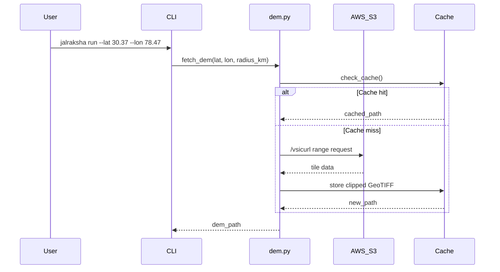
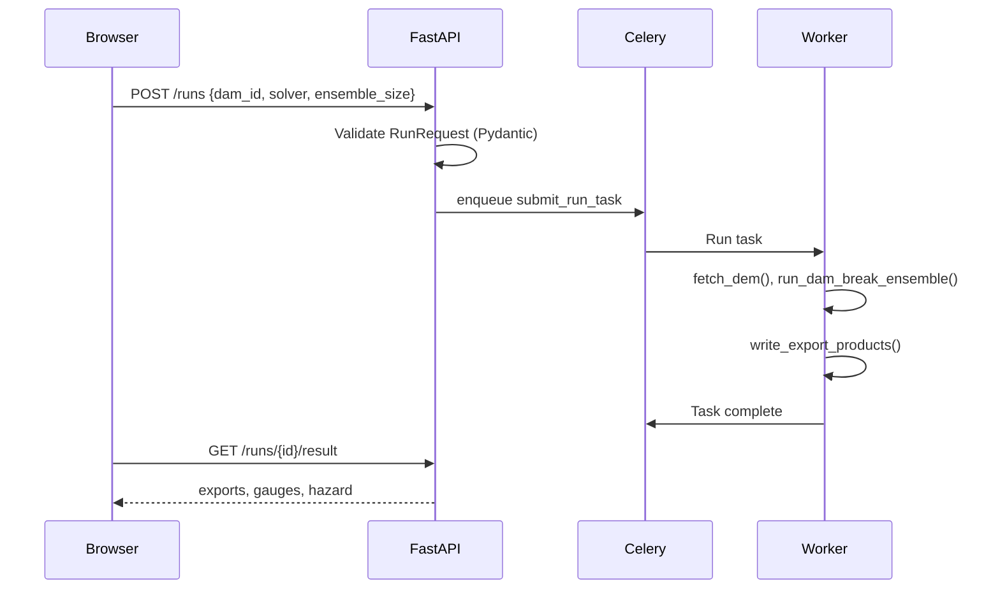

# JalRaksha — Technical Reference Document

**Version:** 1.0  
**Date:** 2026-08-30  
**Project:** JalRaksha — Dam-Break Flood Screening System  
**Purpose:** Smart India Hackathon 2026, Problem Statement 26161 (NTRO)

---

## Table of Contents

1. Executive Summary & Core Purpose
2. Architecture & Data Flow
3. Data Ingestion & Input Pipeline
4. Core Processing Logic & Algorithms
5. Current Gaps, Bugs & Known Vulnerabilities
6. Remediation & Action Plan

---

# 1. Executive Summary & Core Purpose

## What is JalRaksha?

JalRaksha is an open-data dam-break flood screening system designed for rapid emergency response. Given a dam's location, height, and storage capacity, it predicts:

- **When** floodwater arrives at downstream towns
- **How far** the flood spreads (inundation footprint)
- **How bad** it is (hazard classification, population at risk, damage estimates)

It is built for **Smart India Hackathon 2026, Problem Statement 26161 (NTRO)** — a tool for Humanitarian Assistance and Disaster Relief (HADR) planning.

## Core Business Logic

A dam break is two physics problems:

1. **Near-field** (hundreds of metres, tens of seconds): Violent, 3D, turbulent flow → SPH (particle method)
2. **Far-field** (tens of km, hours): Thin sheet flow down the valley → 2D Shallow Water Equations (SWE)

JalRaksha's main engine is the **2D SWE solver**. This produces the maps that matter for evacuation planning.

**Why an ensemble?** Nobody knows the exact hole size or how fast a dam fails. Historical formulas (Froehlich, MacDonald, Wahl) disagree by a factor of 2-3, and Tehri is taller than the dams those formulas were fitted on. So the code runs many possible hydrographs (10-100) and reports median / 5th / 95th percentile — not one magic number.

## Key Features & Capability Matrix

### Primary Features (Working, Demonstrable)

| Feature | Module | Status |
|---------|--------|--------|
| 2D SWE solver (HLLC + Audusse + MUSCL + Manning) | `jalraksha/solver/` | ✅ Working |
| Ensemble breach hydrographs (Froehlich, MacDonald, Wahl) | `jalraksha/terrain/breach.py` | ✅ Working |
| DEM fetch & processing (Copernicus GLO-30 via AWS S3) | `jalraksha/dem.py` | ✅ Working |
| Terrain domain construction (UTM grid, breach location) | `jalraksha/terrain/domain.py` | ✅ Working |
| Manning friction from land cover | `jalraksha/terrain/roughness.py` | ✅ Working |
| Downstream gauge arrival time computation | `jalraksha/run.py` | ✅ Working |
| Export to GeoTIFF (COG) | `jalraksha/export/geotiff.py` | ✅ Working |
| Export to Shapefile | `jalraksha/export/shapefile.py` | ✅ Working |
| Export to KML | `jalraksha/export/kml.py` | ✅ Working |
| Export to XDMF (ParaView) | `jalraksha/export/xdmf_export.py` | ✅ Working |
| Export keyframes (PNG) | `jalraksha/export/keyframes.py` | ✅ Working |
| React dashboard (2D Leaflet + 3D Cesium) | `frontend/src/` | ✅ Working |
| FastAPI REST API | `services/api/jalraksha_service/` | ✅ Working |
| Celery background jobs | `services/api/jalraksha_service/worker.py` | ✅ Working |
| Dam presets (Tehri, Khadakwasla) | `jalraksha/presets.py` | ✅ Working |
| Impact assessment (population, damage, fatalities) | `jalraksha/impact/` | ✅ Working |
| Hazard classification (depth × velocity) | `jalraksha/impact/hazard.py` | ✅ Working |

### Secondary Features (Built, Not Connected to Dashboard)

| Feature | Module | Status |
|---------|--------|--------|
| Delft3D FM Suite adapter | `jalraksha/delft3d/` | ⚠️ Built, not wired |
| SPH near-field solver | `jalraksha/sph/` | ⚠️ Built, not wired |
| Google Earth Engine SAR water detection | `jalraksha/gee/` | ⚠️ Built, needs auth |
| GEE population exposure | `jalraksha/gee/population.py` | ⚠️ Built, needs auth |
| Validation benchmarks (Ritter, Malpasset, Chamoli) | `jalraksha/validation/` | ⚠️ Standalone only |
| ParaView 3D visualization tools | `tools/paraview/` | ⚠️ Standalone only |
| Cesium terrain tile builder | `tools/cesium/` | ⚠️ Standalone only |
| MATLAB export | `tools/matlab/` | ⚠️ Standalone only |

## Intended End Users & Target Environment

**Primary Users:**
- Emergency response agencies (NDMA, SDRF, district administration)
- Dam operators requiring rapid breach assessment
- SIH/NTRO judges evaluating the tool

**Target Environment:**
- **OS:** Windows 10/11, Linux
- **Runtime:** Python 3.10+ with NumPy, SciPy, Numba, Rasterio
- **Deployment:** Docker Compose (API + Worker + Redis + Postgres + Frontend)
- **Minimum Hardware:** Multi-core CPU, 8 GB RAM (no GPU required)
- **Browser:** Modern browser for React dashboard (Chrome, Firefox, Edge)

---

# 2. Architecture & Data Flow

## High-Level System Architecture

```mermaid
graph TB
    subgraph User Interface
        A[React Dashboard<br/>Leaflet 2D + Cesium 3D]
    end
    
    subgraph API Layer
        B[FastAPI REST API<br/>POST /runs, GET /runs/{id}]
        C[Celery Worker<br/>Background Jobs]
    end
    
    subgraph Core Engine
        D[SWE Solver<br/>HLLC + Audusse + MUSCL]
        E[Breach Ensemble<br/>Froehlich/MacDonald/Wahl]
        F[Terrain Pipeline<br/>DEM → UTM Grid]
        G[Impact Assessment<br/>Population/Damage/Fatalities]
    end
    
    subgraph Data Sources
        H[Copernicus GLO-30<br/>AWS S3]
        I[ESA WorldCover<br/>Land Cover]
        J[GHSL<br/>Population]
    end
    
    subgraph External Models
        K[Delft3D FM Suite<br/>2026.02]
        L[SPH<br/>PySPH]
        M[Google Earth Engine<br/>Sentinel-1 SAR]
    end
    
    subgraph Exports
        N[GeoTIFF COG]
        O[Shapefile .shp]
        P[KML .kml]
        Q[XDMF + HDF5]
    end
    
    A --> B
    B --> C
    C --> D
    C --> E
    C --> F
    C --> G
    D --> N
    D --> O
    D --> P
    D --> Q
    F --> H
    F --> I
    G --> J
    C -.->|Optional| K
    C -.->|Optional| L
    C -.->|Optional| M
```

## Component-by-Component Analysis

### 2.1 Core Library (`jalraksha/`)

#### `jalraksha/__init__.py`
Package initializer. Exports version and top-level API.

#### `jalraksha/config.py`
Configuration management. Loads YAML config files, sets up cache directories. Defines `ConfigError` exception.

**Key Functions:**
- `load_config(path)` — loads YAML configuration
- `setup_cache(dir)` — creates cache directory structure

#### `jalraksha/cli.py`
Command-line interface entry point. Provides `jalraksha run`, `jalraksha validate`, `jalraksha cache` subcommands.

**Usage:**
```bash
jalraksha run --dam tehri --lat 30.3789 --lon 78.4789 --height 260 --storage 3540
jalraksha run --config jalraksha.yaml
jalraksha validate --config jalraksha.yaml
jalraksha cache --list
jalraksha cache --clear
```

#### `jalraksha/dem.py`
DEM fetching from Copernicus GLO-30 via AWS S3.

**Data Source:** `https://copernicus-dem-30m.s3.amazonaws.com/`
- Tile layout: `Copernicus_DSM_COG_10_N<lat>_00_E<lon>_00_DEM/<same>.tif`
- Each tile: 1° × 1°, 3600 × 3600 pixels, float32, EPSG:4326
- Uses GDAL `/vsicurl` for partial tile reads (range requests, not full download)

**Key Functions:**
- `fetch_dem(lat, lon, domain_radius_km, cache_dir, offline_mode)` → returns GeoTIFF path
- `latlon_to_utm_zone(lat, lon)` → UTM zone number

#### `jalraksha/presets.py`
Dam preset definitions. Single source of truth for dam parameters.

**Defined Presets:**
- **Tehri** — Uttarakhand, 260 m, 3540 MCM, Bhagirathi River
- **Khadakwasla** — Maharashtra, 51.3 m, 33.5 MCM, Mutha River

**Key Data Structures:**
- `DamPreset` dataclass — all dam parameters
- `GaugePoint` dataclass — downstream gauge locations
- `GAUGES` dict — gauge corridors per dam

#### `jalraksha/run.py`
End-to-end pipeline orchestrator. The "main simulation" function.

**Key Functions:**
- `run_dam_break_ensemble(dam_config, dem_path, ensemble_size, ...)` → results dict
- `write_export_products(results_ensemble, h_max_median, ...)` → export paths dict

**Pipeline Steps:**
1. Build domain from DEM
2. Compute breach location
3. Generate ensemble of breach hydrographs
4. Run SWE solver for each member
5. Compute ensemble statistics (median, p05, p95)
6. Compute arrival times at gauges
7. Write export products (GeoTIFF, SHP, KML, XDMF)

#### `jalraksha/solver/core.py`
2D Shallow Water Equations solver.

**Numerics:**
- **Grid:** Uniform Cartesian, cell-centred finite volume
- **Flux:** HLLC (Harten-Lax-van Leer-Contact) Riemann solver
- **Well-balancing:** Audusse hydrostatic reconstruction (keeps still lakes still)
- **Reconstruction:** MUSCL (Monotonic Upstream-Centred Scheme for Conservation Laws)
- **Friction:** Manning's n source term
- **Dry bed:** Threshold-based wetting/drying (h < 1e-6 = dry)

**State Variables per Cell:**
- `h` — water depth (m)
- `hu` — east momentum (m²/s)
- `hv` — north momentum (m²/s)
- `b` — bed elevation (m)

#### `jalraksha/solver/flux.py`
HLLC Riemann solver implementation.

**Key Functions:**
- `hllc_flux(ql, qr, ...)` — computes inter-cell flux
- Handles subcritical, supercritical, and transcritical flows

#### `jalraksha/solver/parallel.py`
Ensemble parallelization using multiprocessing.

**Key Functions:**
- `run_ensemble(members, ...)` — runs members in parallel

#### `jalraksha/terrain/domain.py`
Terrain domain construction from DEM.

**Key Functions:**
- `build_domain(dam_config, dem_path, target_resolution)` → `Grid` object
- `compute_breach_location(grid, dam_config)` → breach cell indices

#### `jalraksha/terrain/breach.py`
Breach hydrograph generation from published regressions.

**Key Functions:**
- `synthesize_breach_ensemble(dam_config, ensemble_size)` → list of hydrographs
- `ensemble_statistics(members)` → median, p05, p95 hydrographs

**Regressions Used:**
- Froehlich (1995, 2008)
- MacDonald & Langridge-Monopolis (1984)
- Wahl (2004) uncertainty bounds

#### `jalraksha/terrain/roughness.py`
Manning's n friction from land cover classification.

**Source:** ESA WorldCover (when available)

#### `jalraksha/terrain/conditioning.py`
Terrain conditioning: burn streams, fix pits, ensure drainage.

#### `jalraksha/impact/hazard.py`
Hazard classification from depth × velocity.

**Classification (FD2320-style):**
| Depth × Velocity | Class |
|------------------|-------|
| < 0.5 | Low |
| 0.5 – 1.0 | Moderate |
| 1.0 – 2.0 | Significant |
| > 2.0 | Extreme |

#### `jalraksha/impact/population.py`
Population at risk from GHSL data over the flood extent.

#### `jalraksha/impact/damage.py`
Damage estimates using depth-damage curves.

**References:** Graham (1999), DeKay & McClelland

#### `jalraksha/impact/fatality.py`
Fatality estimates using Jonkman (2007) / Graham (2009) methods.

#### `jalraksha/export/geotiff.py`
Cloud-Optimized GeoTIFF export.

#### `jalraksha/export/shapefile.py`
ESRI Shapefile export (zipped: .shp/.shx/.dbf/.prj).

#### `jalraksha/export/kml.py`
KML export for Google Earth.

#### `jalraksha/export/xdmf_export.py`
XDMF + HDF5 time series export for ParaView.

#### `jalraksha/export/keyframes.py`
PNG keyframe generation for 2D animation.

#### `jalraksha/delft3d/runner.py`
Delft3D FM Suite binary execution adapter.

**Key Functions:**
- `resolve_dflowfm(custom_path)` → executable path or None
- `is_dflowfm_available()` → bool

**Current Issue:** Looks for `dflowfm` on PATH, but Delft3D FM Suite 2026.02 uses `DeltaShell.Console.exe`.

#### `jalraksha/delft3d/setup.py`
DIMR config XML generation for Delft3D.

#### `jalraksha/delft3d/dfm_model.py`
D-Flow FM model input file (.mdf) generation.

#### `jalraksha/delft3d/comparison.py`
SPH vs Delft3D comparison metrics.

#### `jalraksha/delft3d/ugrid.py`
Unstructured grid handling.

#### `jalraksha/sph/core.py`
SPH (Smoothed Particle Hydrodynamics) particle solver core.

#### `jalraksha/sph/domain.py`
SPH domain setup.

#### `jalraksha/sph/coupling.py`
SPH-SWE one-way coupling (2D result drives SPH inflow).

#### `jalraksha/sph/pysph_runner.py`
PySPH integration wrapper.

#### `jalraksha/gee/sar.py`
Sentinel-1 SAR water detection via Google Earth Engine (729 lines).

**Method:** Otsu thresholding on VV polarization, split-based approach for bimodal tiles.

#### `jalraksha/gee/auth.py`
GEE authentication (uses `~/.config/earthengine/credentials`).

#### `jalraksha/gee/population.py`
GEE population exposure analysis.

#### `jalraksha/validation/benchmarks.py`
Analytical benchmarks: Ritter dam-break, lake-at-rest, mass conservation.

#### `jalraksha/validation/delft3d_benchmark.py`
Delft3D comparison benchmarks: Malpasset, Chamoli.

#### `jalraksha/validation/metrics.py`
Validation metrics: RMSE, bias, Nash-Sutcliffe efficiency.

#### `jalraksha/validation/sensitivity.py`
Sensitivity analysis utilities.

### 2.2 API Service (`services/api/jalraksha_service/`)

#### `main.py` — FastAPI Application

**Endpoints:**
| Method | Path | Description |
|--------|------|-------------|
| POST | `/runs` | Submit simulation, enqueue Celery job |
| GET | `/runs/{run_id}` | Status + progress |
| GET | `/runs/{run_id}/result` | Exports, gauges, hazard |
| GET | `/runs/{run_id}/comparison` | Delft3D comparison |
| GET | `/dams` | Dam presets |
| GET | `/gauges/{run_id}` | Per-gauge results |
| GET | `/gee/latest` | Near-real-time SAR extent |
| GET | `/health` | Liveness check |

#### `worker.py` — Celery App

Background job processing. Connects to Redis for task queue.

#### `tasks.py` — Celery Job Definitions

Thin wrappers around `run_dam_break_ensemble()`.

#### `schemas.py` — Pydantic Models

Request/response schemas for API validation.

#### `config.py` — Service Configuration

Settings, demo dam registry.

#### `db.py` — Database

SQLite for job metadata (run_id, status, timestamps).

### 2.3 Frontend (`frontend/`)

#### `src/App.jsx`
Main React application component.

#### `src/api.js`
API client for backend communication.

#### `src/data/entities.js`
Data entity definitions.

#### `src/state/SimulationClock.jsx`
Time synchronization for animations.

#### `src/panels/`
Dashboard panel components:
- `ControlPanel.jsx` — Dam/solver selection, run button
- `Map2D.jsx` — Leaflet 2D map with flood overlay
- `Scene3D.jsx` — Cesium 3D globe
- `GaugesPanel.jsx` — Gauge arrival time table
- `EnsemblePanel.jsx` — Uncertainty visualization
- `ImpactPanel.jsx` — Population/damage/fatality
- `ComparisonPanel.jsx` — SWE vs Delft3D comparison
- `DownloadsPanel.jsx` — Export download links
- `ValidationPanel.jsx` — Benchmark results
- `SphPanel.jsx` — SPH visualization

### 2.4 Tests (`tests/`)

Comprehensive test suite covering:
- Solver correctness (test_solver.py)
- Terrain pipeline (test_terrain.py)
- Breach generation (test_breach.py)
- DEM processing (test_dem.py)
- Exports (test_export.py)
- API endpoints (test_api.py)
- Integration (test_integration.py)
- Impact assessment (test_impact.py)
- Delft3D adapter (test_delft3d.py)
- SPH (test_sph.py)
- GEE (test_gee.py)
- Validation (test_validation.py)

### 2.5 Tools (`tools/`)

#### `tools/paraview/`
ParaView 3D visualization:
- `make_dataset.py` — Dataset generation
- `reservoir.py` — Reservoir surface extraction
- `synthetic_flood.py` — Synthetic flood visualization
- `base_block.py` — Base block for 3D

#### `tools/cesium/`
Cesium terrain tools:
- `build_terrain_tiles.py` — Terrain tile generation
- `upload_terrain_to_ion.py` — Upload to Cesium Ion

#### `tools/matlab/`
MATLAB export utilities.

#### `tools/sih-presentation/`
SIH presentation builder.

---

# 3. Data Ingestion & Input Pipeline

## Sources of Data

### 3.1 Terrain Data (DEM)

**Source:** Copernicus DEM GLO-30
- **Endpoint:** `https://copernicus-dem-30m.s3.amazonaws.com/`
- **Resolution:** 1 arc-second (~30 m)
- **Format:** Cloud-Optimized GeoTIFF
- **Coverage:** Global
- **License:** Free, open, no login required
- **Tile naming:** `Copernicus_DSM_COG_10_N<lat>_00_E<lon>_00_DEM.tif`

**Why this source:** Open, no authentication, documented by Copernicus programme.

**Why NOT other sources:**
- FABDEM: CC BY-NC-SA (non-commercial restriction)
- MERIT: CC BY-NC (non-commercial restriction)
- CartoDEM / Bhuvan: Geo-fenced, login-gated
- India-WRIS: Forbidden (login-gated)

### 3.2 Land Cover (Friction)

**Source:** ESA WorldCover
- **Resolution:** 10 m
- **Use:** Manning's n friction coefficients
- **Fallback:** Default n = 0.035 (grassland) if unavailable

### 3.3 Population

**Source:** GHSL (Global Human Settlement Layer)
- **Use:** Population at risk estimation
- **Integration:** Via GEE or direct download

### 3.4 User Inputs (Dam Parameters)

**Via CLI:**
```bash
jalraksha run --dam tehri --lat 30.3789 --lon 78.4789 --height 260 --storage 3540
```

**Via API:**
```json
POST /runs
{
    "dam_id": "tehri",
    "solver": "swe",
    "ensemble_size": 100,
    "solver_duration_s": 1800,
    "target_resolution": 200
}
```

**Via Config File (jalraksha.yaml):**
```yaml
dam_name: tehri
dam_location: [30.3789, 78.4789]
dam_height: 260
gross_storage: 3540
crs: "EPSG:32644"
```

### 3.5 Environment Variables

| Variable | Purpose | Required |
|----------|---------|----------|
| `JALRAKSHA_DFLOWFM_EXE` | Path to Delft3D executable | Optional |
| `JALRAKSHA_GEE_PROJECT` | GCP project ID for GEE | For GEE features |
| `CESIUM_ION_TOKEN` | Cesium Ion access token | For 3D terrain |
| `CELERY_EAGER` | Run tasks synchronously (no Redis) | For laptop demo |

## Ingestion Mechanisms

### DEM Fetch (Primary Pipeline)



### Ingestion via API



## Parsing, Validation & Transformation

### Input Validation (Pydantic Schemas)

**`RunRequest`:**
- `dam_id`: Optional[str] — must match a preset
- `lat`, `lon`, `height_m`, `storage_mm3`: Optional[float] — required if no preset
- `ensemble_size`: int (1-10000, default 100)
- `solver`: "swe" | "delft3d" | "both"
- `solver_duration_s`: float > 0 (default 1800)
- `target_resolution`: float > 0 (default 200)

### DEM Transformation Pipeline

1. **Fetch:** Download 1° tiles overlapping domain
2. **Merge:** Mosaic multiple tiles
3. **Clip:** Cut to bounding box (dam + 60 km radius)
4. **Reproject:** Convert from EPSG:4326 to UTM
5. **Resample:** To target resolution (e.g., 200 m)
6. **Condition:** Burn streams, fix pits
7. **Cache:** Store clipped GeoTIFF for reuse

### Breach Hydrograph Generation

1. **Select regression:** Froehlich, MacDonald, or Wahl
2. **Sample parameters:** Draw from uncertainty distributions
3. **Compute peak outflow:** Q_p = f(height, storage)
4. **Compute breach geometry:** Width, side slope
5. **Generate hydrograph:** Time series of discharge Q(t)

---

# 4. Core Processing Logic & Algorithms

## 4.1 2D Shallow Water Equations

### Governing Equations

The 2D SWE (Saint-Venant equations) in conservative form:

```
∂h/∂t + ∂(hu)/∂x + ∂(hv)/∂y = 0

∂(hu)/∂t + ∂(hu² + gh²/2)/∂x + ∂(huv)/∂y = -gh ∂b/∂x - τ_bx/ρ

∂(hv)/∂t + ∂(huv)/∂x + ∂(hv² + gh²/2)/∂y = -gh ∂b/∂y - τ_by/ρ
```

Where:
- `h` = water depth
- `u`, `v` = depth-averaged velocities
- `b` = bed elevation
- `g` = gravitational acceleration
- `τ_b` = bed shear stress

### Numerical Method

**Spatial Discretisation:** Cell-centred finite volume on uniform Cartesian grid

**Flux Computation:** HLLC Riemann solver
- Estimates wave speeds (S_L, S_R, S_*)
- Computes star-region fluxes
- Handles dry states (h ≈ 0)

**Well-Balancing:** Audusse hydrostatic reconstruction
- Reconstructs interface values to preserve hydrostatic balance
- Critical for still-lake test case

**Slope Limiting:** MUSCL (Monotonic Upstream-Centred Scheme)
- Second-order accuracy in space
- Minmod limiter to prevent oscillations

**Friction Treatment:** Manning's n
- Source term: S_f = n² g h^(1/3) |V| V
- Implicit treatment for stability

### Boundary Conditions

- **Inflow:** Breach hydrograph Q(t) at breach cell
- **Outflow:** Free outflow (zero gradient)
- **Wall:** Reflective (no normal flux)
- **Dry:** Threshold h < 1e-6 m = dry cell

## 4.2 Ensemble Generation

### Breach Parameter Uncertainty

Historical regressions disagree by factor 2-3:

| Regression | Peak Outflow Formula |
|------------|---------------------|
| Froehlich (1995) | Q_p = 0.607 × V^0.295 × H^1.24 |
| MacDonald | Q_p = 3.85 × (VH)^0.46 |
| Wahl (2004) | Uncertainty bounds on Froehlich |

### Ensemble Sampling

For each member i ∈ {1, ..., N}:
1. Sample breach width B_i ~ LogNormal(μ_B, σ_B)
2. Sample breach time T_r ~ LogNormal(μ_T, σ_T)
3. Sample side slope z ~ Uniform(0.5, 1.5)
4. Compute Q_p, t_peak from regression
5. Construct triangular/polynomial hydrograph

## 4.3 Arrival Time Computation

**Definition:** First time depth ≥ 0.1 m at gauge location.

**Gauge Snapping:** Gauges snap to the lowest nearby cell (the river), not the nearest GPS cell (often a canyon wall).

## 4.4 Impact Assessment

### Hazard Classification

```
h × v < 0.5    → Low
0.5 ≤ h × v < 1.0  → Moderate
1.0 ≤ h × v < 2.0  → Significant
h × v ≥ 2.0    → Extreme
```

### Population at Risk

1. Overlay flood extent on GHSL population grid
2. Sum population in cells where h > threshold
3. Report with uncertainty range

### Damage Estimation

1. Apply depth-damage curves (Graham, DeKay-McClelland)
2. Sum damage per land use class
3. Report in INR

### Fatality Estimation

1. Jonkman (2007): f_fatal = f(flood severity, warning time)
2. Graham (2009): Mortality rate vs depth-velocity
3. Report range (optimistic/pessimistic)

## 4.5 Storage & State Management

### Cache Structure

```
./data/
├── dem/
│   ├── dem_30.38_78.48_clipped.tif
│   └── mosaic_30.38_78.48.tif
├── runs/
│   ├── {run_id}/
│   │   ├── exports/
│   │   │   ├── cog_h_max_median.tif
│   │   │   ├── shp_inundation_zip.zip
│   │   │   ├── kml_inundation.kml
│   │   │   └── xdmf_series.xdmf
│   │   └── keyframes/
│   │       ├── frame_0000.png
│   │       └── ...
│   └── ...
└── gee/
    └── observed_extent.tif
```

### Database (SQLite)

```sql
CREATE TABLE runs (
    run_id TEXT PRIMARY KEY,
    status TEXT,  -- queued | running | done | failed
    solver TEXT,
    created_at TIMESTAMP,
    completed_at TIMESTAMP,
    config JSON,
    result JSON
);
```

---

# 5. Current Gaps, Bugs & Known Vulnerabilities

## 5.1 Broken Code & Errors

### Delft3D Runner (CRITICAL)

**File:** `jalraksha/delft3d/runner.py`

**Issue:** Searches for `dflowfm` on PATH, but Delft3D FM Suite 2026.02 uses `DeltaShell.Console.exe`.

```python
# Current (broken):
def resolve_dflowfm(custom_path=None):
    # Searches for "dflowfm" literal string
    # Won't find DeltaShell.Console.exe

# Should be:
def resolve_delft3d(custom_path=None):
    # Check JALRAKSHA_DELFT3D_EXE env var
    # Check known location: C:\Program Files\Deltares\Delft3D FM Suite 2026.02 OpenHMWQ\bin\DeltaShell.Console.exe
    # Fall back to PATH search for "DeltaShell.Console"
```

**Impact:** `solver="delft3d"` silently falls back to SWE. No error shown to user.

### SPH Module (NOT WIRED)

**Files:** `jalraksha/sph/*.py`

**Issue:** Complete SPH implementation exists but is never called from the API or dashboard.

**Impact:** `solver="sph"` option in API schema does nothing.

### GEE Authentication (INCOMPLETE)

**File:** `jalraksha/gee/auth.py`

**Issue:** Credentials file exists at `~/.config/earthengine/credentials`, but `JALRAKSHA_GEE_PROJECT` env var is not set.

**Impact:** GEE SAR overlay returns "unavailable" on dashboard.

## 5.2 Incomplete Features (TODOs/FIXMEs)

### Unvetted Coefficients

**File:** `jalraksha/presets.py`

Multiple dam parameters marked as UNVETTED:
- Khadakwasla height_m, storage_mm3 — user-supplied, no primary source
- Tehri frl_m, crest_m — preset literal, no THDC/CWC citation

**Impact:** Solver runs with these values, but they lack authoritative source.

### Missing Implementations

| Feature | Status | Impact |
|---------|--------|--------|
| Delft3D → dashboard | Not wired | Judges can't see Delft3D comparison |
| SPH → dashboard | Not wired | Judges can't see SPH results |
| GEE → dashboard | Not wired | Judges can't see SAR overlay |
| Validation → dashboard | Not wired | Judges can't see benchmark proof |
| Impact → dashboard | Not wired | Judges can't see damage estimates |

## 5.3 Edge Cases & Failure Points

### DEM Fetch Failures

- **Offline mode:** Falls back to synthetic terrain (flat plane)
- **NoData edges:** Can create boundary sinks if not clipped properly
- **Tile gaps:** Some Copernicus tiles have NoData over water bodies

### Solver Instability

- **Dry cells:** h < 1e-6 threshold can cause mass conservation errors
- **Steep terrain:** HLLC may produce negative depths on cliffs
- **Large domains:** 100 km radius at 200 m = 1000×1000 grid = ~35 min per member

### Ensemble Size

- **Too small (< 10):** Uncertainty band not meaningful
- **Too large (> 1000):** Compute time prohibitive for demo

## 5.4 Dependency Issues

### Python Packages

| Package | Version | Status |
|---------|---------|--------|
| NumPy | Latest | ✅ Working |
| SciPy | Latest | ✅ Working |
| Numba | Latest | ✅ Working |
| Rasterio | Latest | ✅ Working |
| GDAL | System lib | ✅ Working |
| FastAPI | Latest | ✅ Working |
| Celery | Latest | ✅ Working |
| PySPH | Optional | ⚠️ Not installed by default |
| earthengine-api | Optional | ⚠️ Needs project config |

### System Dependencies

| Dependency | Status |
|------------|--------|
| Redis | Required for Celery (or use CELERY_EAGER=1) |
| Postgres | Optional (SQLite default) |
| GDAL (system) | Required for raster operations |
| Delft3D FM Suite | Optional (installed at C:\Program Files\Deltares\...) |
| Cesium Ion Token | Optional (for 3D terrain) |

---

# 6. Remediation & Action Plan

## 6.1 Bug Fixes (Priority Order)

### Fix 1: Delft3D Runner (HIGH)

**File:** `jalraksha/delft3d/runner.py`

```python
# Add to resolve_dflowfm() or create new resolve_delft3d():
import os

DELFT3D_KNOWN_PATH = r"C:\Program Files\Deltares\Delft3D FM Suite 2026.02 OpenHMWQ\bin\DeltaShell.Console.exe"

def resolve_delft3d(custom_path=None):
    # 1. Check explicit path
    if custom_path and os.path.isfile(custom_path):
        return custom_path
    
    # 2. Check environment variable
    env_path = os.environ.get("JALRAKSHA_DELFT3D_EXE")
    if env_path and os.path.isfile(env_path):
        return env_path
    
    # 3. Check known location
    if os.path.isfile(DELFT3D_KNOWN_PATH):
        return DELFT3D_KNOWN_PATH
    
    # 4. Search PATH for DeltaShell.Console
    for path_dir in os.environ.get("PATH", "").split(os.pathsep):
        candidate = os.path.join(path_dir, "DeltaShell.Console.exe")
        if os.path.isfile(candidate):
            return candidate
    
    return None
```

### Fix 2: Wire Delft3D to API (HIGH)

**File:** `services/api/jalraksha_service/tasks.py`

```python
# In submit_run_task():
if solver in ("delft3d", "both"):
    from jalraksha.delft3d.runner import resolve_delft3d
    delft3d_path = resolve_delft3d()
    if delft3d_path is None:
        # Fall back to SWE with warning
        logger.warning("Delft3D not found, falling back to SWE")
        solver = "swe"
```

### Fix 3: Set JALRAKSHA_GEE_PROJECT (HIGH)

```cmd
setx JALRAKSHA_GEE_PROJECT "your-gcp-project-id" /M
```

Then restart all terminals.

### Fix 4: Wire Impact to Dashboard (MEDIUM)

**File:** `frontend/src/panels/ImpactPanel.jsx`

Ensure the panel:
1. Receives impact data from `/runs/{id}/result`
2. Displays population at risk
3. Displays damage estimate with uncertainty
4. Displays fatality estimate with range

### Fix 5: Wire Validation to Dashboard (MEDIUM)

**File:** `frontend/src/panels/ValidationPanel.jsx`

Add API endpoint:
```
GET /api/validate?test=ritter
```

Returns:
```json
{
    "test": "ritter",
    "passed": true,
    "max_error": 0.03,
    "plot_url": "/files/validation_ritter.png"
}
```

## 6.2 Optimization Opportunities

### Performance

1. **Numba JIT:** Already used in solver. Ensure all hot loops are `@njit` decorated.
2. **Parallel ensemble:** Already uses multiprocessing. Consider joblib for simpler API.
3. **DEM caching:** Already implemented. Ensure cache invalidation is correct.
4. **COG generation:** Use `rio-cogo` for faster Cloud-Optimized GeoTIFF creation.

### Code Quality

1. **Type hints:** Add to all public functions.
2. **Docstrings:** Already comprehensive. Maintain.
3. **Error handling:** Add more specific exception types.
4. **Logging:** Replace `print()` with `logging` module.

### Security

1. **Input validation:** Pydantic schemas already validate. Add bounds checking.
2. **Path traversal:** Sanitize file paths in export functions.
3. **CORS:** Currently `allow_origins=["*"]`. Restrict in production.
4. **Secrets:** Don't log environment variables.

## 6.3 Demo-Day Checklist

### Pre-Baked Runs

- [ ] Tehri 100-member ensemble (pre-computed)
- [ ] Khadakwasla 100-member ensemble (pre-computed)
- [ ] Both runs exported to all formats (.tif, .shp, .kml, .xdmf)

### Environment

- [ ] Redis running (or CELERY_EAGER=1)
- [ ] Frontend dev server running
- [ ] API server running
- [ ] DEM cached locally (offline demo)

### Fallback Plan

- [ ] If UI dies: CLI log + GeoTIFF in QGIS + one keyframe PNG
- [ ] If Delft3D fails: Show SWE-only with "Delft3D unavailable" badge
- [ ] If GEE fails: Show "GEE not configured" message
- [ ] If internet fails: Use cached DEM + pre-baked runs

---

# Appendix A: File Inventory

## Core Library (`jalraksha/`)

| File | Lines | Purpose |
|------|-------|---------|
| `__init__.py` | ~10 | Package init |
| `api.py` | ~200 | High-level API |
| `cache.py` | ~100 | Cache management |
| `cli.py` | ~168 | CLI entry point |
| `config.py` | ~80 | Configuration |
| `dem.py` | ~607 | DEM fetch/processing |
| `hardening.py` | ~150 | Dam type hardening |
| `presets.py` | ~421 | Dam presets |
| `run.py` | ~843 | Pipeline orchestrator |

## Solver (`jalraksha/solver/`)

| File | Lines | Purpose |
|------|-------|---------|
| `core.py` | ~400 | SWE solver core |
| `flux.py` | ~200 | HLLC flux |
| `parallel.py` | ~100 | Ensemble parallelization |
| `types.py` | ~80 | Grid/State types |

## Terrain (`jalraksha/terrain/`)

| File | Lines | Purpose |
|------|-------|---------|
| `breach.py` | ~300 | Breach hydrographs |
| `conditioning.py` | ~150 | Terrain conditioning |
| `domain.py` | ~250 | Domain construction |
| `roughness.py` | ~100 | Manning friction |

## Impact (`jalraksha/impact/`)

| File | Lines | Purpose |
|------|-------|---------|
| `damage.py` | ~150 | Damage estimation |
| `fatality.py` | ~120 | Fatality estimation |
| `hazard.py` | ~100 | Hazard classification |
| `population.py` | ~100 | Population at risk |

## Export (`jalraksha/export/`)

| File | Lines | Purpose |
|------|-------|---------|
| `geotiff.py` | ~200 | GeoTIFF export |
| `shapefile.py` | ~150 | Shapefile export |
| `kml.py` | ~120 | KML export |
| `xdmf_export.py` | ~180 | XDMF export |
| `keyframes.py` | ~100 | Keyframe generation |
| `georef.py` | ~80 | Georeferencing |
| `matlab_export.py` | ~80 | MATLAB export |

## External Models

| Module | Files | Status |
|--------|-------|--------|
| `delft3d/` | 5 files | Built, not wired |
| `sph/` | 4 files | Built, not wired |
| `gee/` | 3 files | Built, needs auth |
| `validation/` | 4 files | Standalone |

---

# Appendix B: API Reference

## Endpoints

### POST /runs
Submit a simulation job.

**Request:**
```json
{
    "dam_id": "tehri",
    "solver": "swe",
    "ensemble_size": 100,
    "solver_duration_s": 1800,
    "target_resolution": 200
}
```

**Response:**
```json
{
    "run_id": "abc123",
    "status": "queued",
    "solver": "swe"
}
```

### GET /runs/{run_id}
Get run status.

**Response:**
```json
{
    "run_id": "abc123",
    "status": "done",
    "progress_pct": 100.0,
    "solver": "swe"
}
```

### GET /runs/{run_id}/result
Get run results.

**Response:**
```json
{
    "run_id": "abc123",
    "dam_name": "Tehri Dam",
    "exports": [
        {"kind": "cog_h_max_median", "path_or_url": "/files/abc123/h_max_median.tif"},
        {"kind": "shp_inundation_zip", "path_or_url": "/files/abc123/inundation.zip"},
        {"kind": "kml_inundation", "path_or_url": "/files/abc123/inundation.kml"}
    ],
    "gauges": [
        {"gauge_name": "Koteshwar", "distance_km": 13.0, "arrival_time_s": 1200, "max_depth_m": 15.2}
    ],
    "h